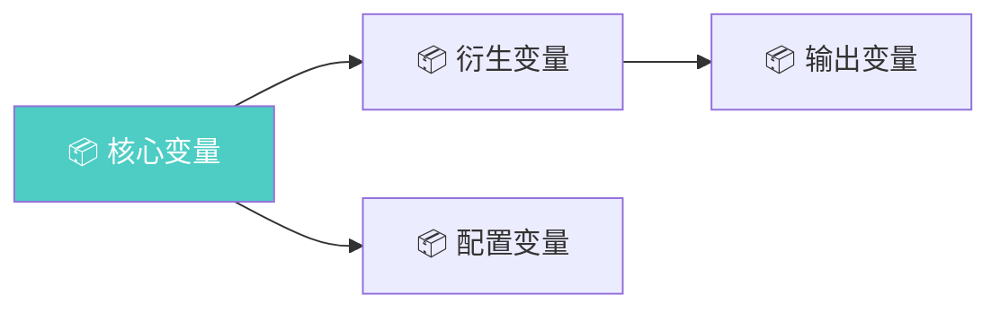
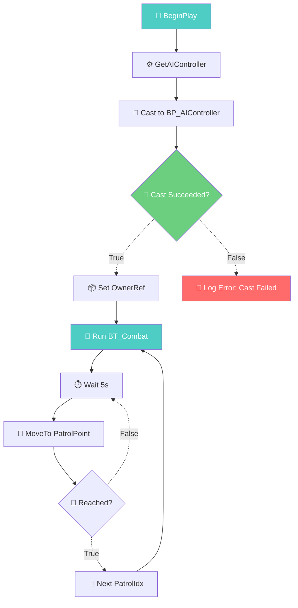
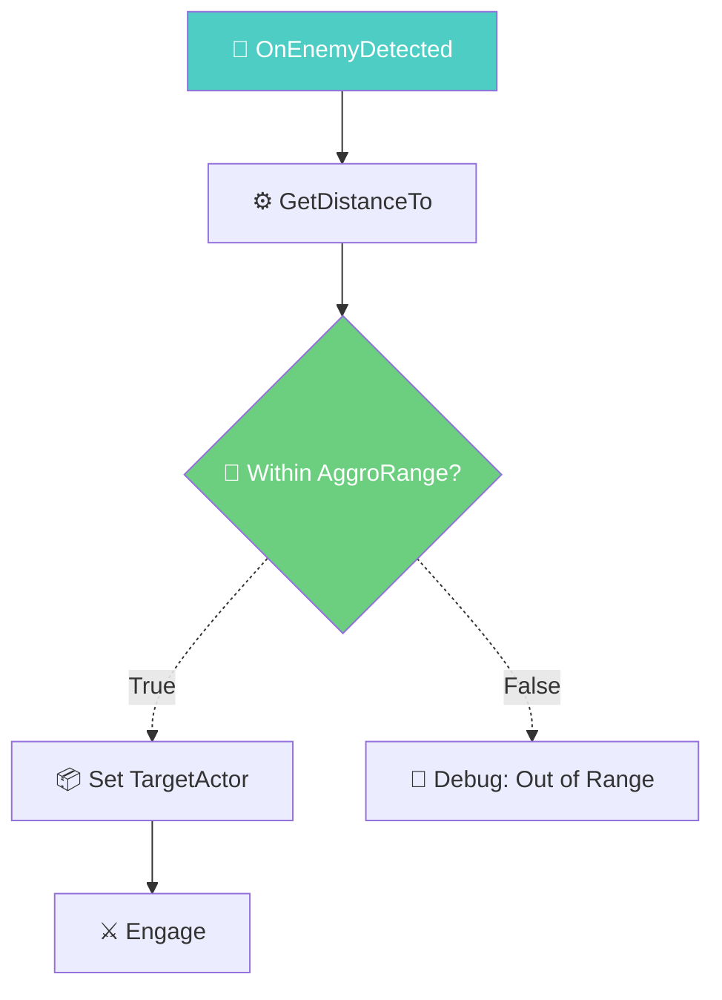
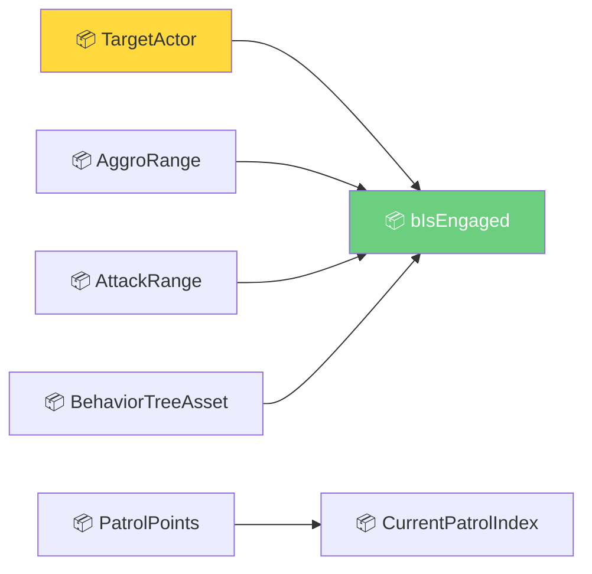
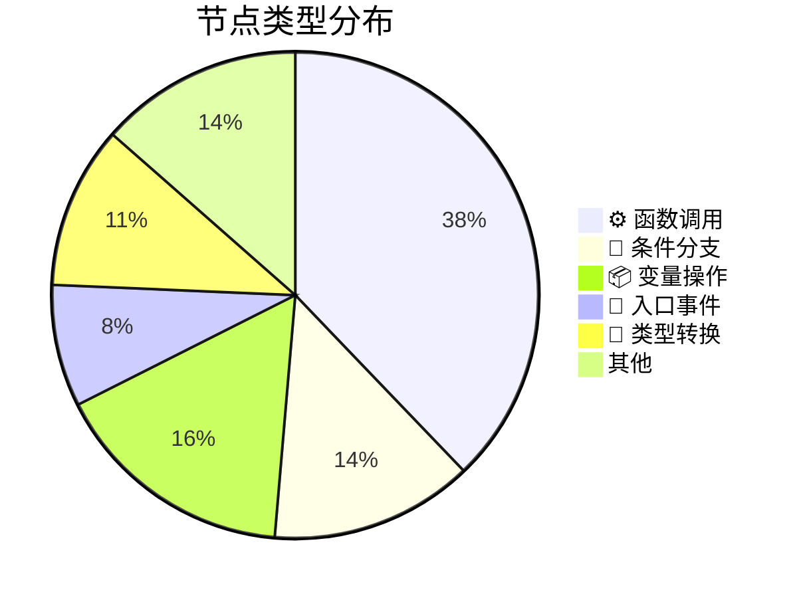
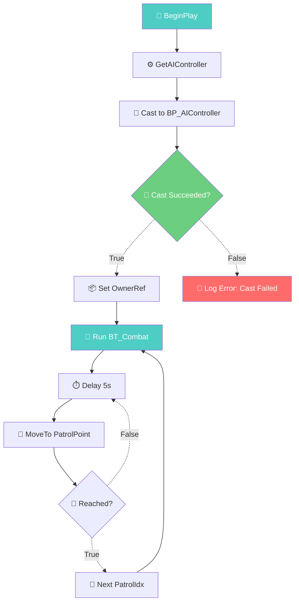
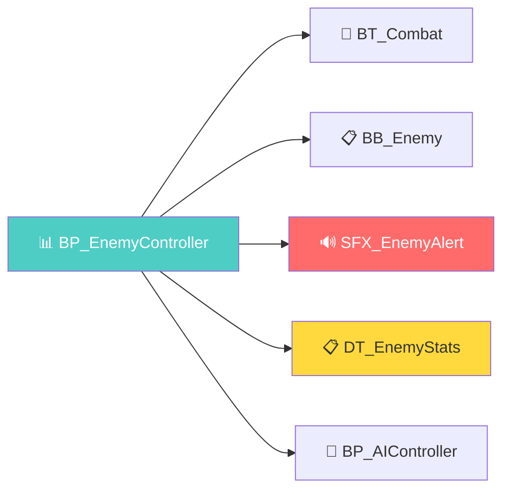
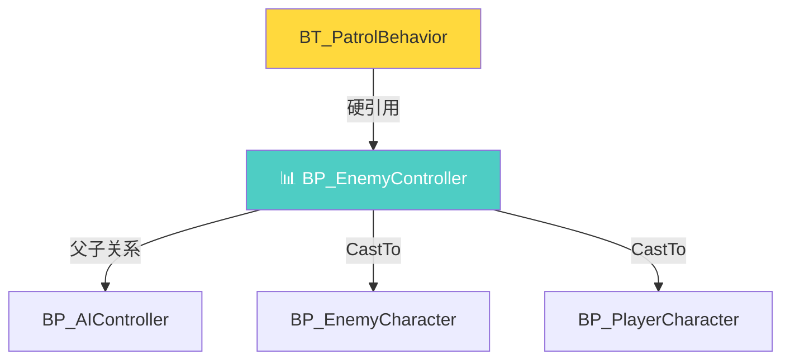

# 📊 {蓝图名} 蓝图分析报告

> **模板版本：** v1.0  
> **生成日期：** {YYYY-MM-DD}  
> **分析深度：** `full` / `basic`  
> **参考标准：** `templates/mermaid_tags.md` v1.0

---

## 一、基本信息卡片

| 属性 | 值 |
|:---|:---|
| **蓝图名称** | `{BlueprintName}` |
| **资产路径** | `{/Game/Path/To/Blueprint}` |
| **蓝图类型** | `{Actor / Widget / Component / FunctionLibrary / Interface / …}` |
| **父类** | `{ParentClass}` |
| **实现的接口** | `{IInteractable, IDamageable, …}` 或 `无` |
| **编译状态** | ✅ 通过 / ⚠️ {N} 个警告 / 🔴 {N} 个错误 |
| **最后修改** | `{YYYY-MM-DD HH:MM}` |
| **大小（KB）** | `{N}` |
| **节点总数** | `{N}`（含自定义事件 `{N}`、函数 `{N}`） |

> **摘要：** {一句话描述蓝图的核心职责，例如："控制敌方 AI 巡逻、索敌与战斗行为的 AIController 子类"}

---

## 二、变量清单

> **统计：** 共 `{N}` 个变量（公开 `{N}` / 私有 `{N}`）

| # | 变量名 | 类型 | 默认值 | Category | Expose | 说明 |
|:---:|:---|:---|:---|:---|:---:|:---|
| 1 | `{VarName}` | `{Type}` | `{Default}` | `{Category}` | {✅/❌} | {简短说明} |
| 2 | `{VarName}` | `{Type}` | `{Default}` | `{Category}` | {✅/❌} | {简短说明} |
| … | … | … | … | … | … | … |

### 2.1 变量统计摘要

| 类型 | 数量 | 典型用途 |
|:---|:---:|:---|
| **float / int32** | `{N}` | {计时、距离、计数等} |
| **bool** | `{N}` | {状态标志} |
| **Object Reference** | `{N}` | {引用其他资产/蓝图} |
| **Struct / Enum** | `{N}` | {数据结构 / 枚举选项} |
| **TArray / TMap** | `{N}` | {集合数据} |
| **其他** | `{N}` | {简要说明} |

### 2.2 变量依赖图（Mermaid）



> ⚠️ 此图仅为变量间依赖关系的示意框架，请根据实际蓝图替换节点标签。

---

## 三、节点拓扑

> **统计：** 共 `{N}` 个节点，`{N}` 条连线

### 3.1 节点类型分布


### 3.2 核心节点清单

| # | 节点类型 | 标签 | 所在图 | 输入连线 | 输出连线 | 说明 |
|:---:|:---|:---|:---|:---:|:---:|:---|
| 1 | `🚀 Event` | `{EventName}` | `EventGraph` | 0 | `{N}` | {说明} |
| 2 | `⚙️ Function` | `{FuncName}` | `EventGraph` | `{N}` | `{N}` | {说明} |
| … | … | … | … | … | … | … |

### 3.3 连线拓扑（关键路径）

| From | To | 连线类型 | 说明 |
|:---|:---|:---|:---|
| `🚀 BeginPlay` | `⚙️ InitReferences` | → 执行流 | 初始化入口 |
| `⚙️ InitReferences` | `📦 Set OwnerRef` | → 执行流 | 缓存引用 |
| … | … | … | … |

### 3.4 复杂度指标

| 指标 | 值 | 评价 |
|:---|:---|:---|
| **节点总数** | `{N}` | {🟢 轻量 (<50) / 🟡 中等 (50-200) / 🔴 重型 (>200)} |
| **最大深度** | `{N}` 层 | {🟢 扁平 / 🟡 一般 / 🔴 过深} |
| **分支密度** | `{N}%`（Branch 节点占比） | {🟢 线形 / 🟡 适中 / 🔴 分支密集} |
| **事件驱动度** | `{N}` 个事件入口 | {🟢 单一 / 🟡 少量 / 🔴 多入口需注意} |

---

## 四、Mermaid 流程图

> **格式：** Mermaid `graph TD`（自上而下）  
> **标签标准：** `templates/mermaid_tags.md` v1.0 — 24 标签 + 4 连线 + 5 色  
> **图例：** 🔴阻断 🟡警告 🟢健康 🔵入口 ⚪未识别

### 4.1 {蓝图名} 主流程图



> **流程说明：**  
> 1. `🚀 BeginPlay` → 获取 AI 控制器引用  
> 2. `🎯 Cast` → 类型转换验证（失败 → 🔴 日志错误）  
> 3. `🧠 Run BT_Combat` → 启动战斗行为树（入口节点）  
> 4. `🏃 MoveTo` ↔ `🔄 Next PatrolIdx` → 巡逻循环（到达 → 切换目标 → 继续移动）

### 4.2 {自定义事件}子流程图（可选）



> ⚠️ 若蓝图仅含单一 EventGraph，此节可省略或标注「无独立子图」。

---

## 五、引用资产

> **统计：** 共 `{N}` 个外部资产引用

### 5.1 按资产类型分组

| 类型 | 数量 | 关键资产 |
|:---|:---:|:---|
| **贴图 / 材质** | `{N}` | `{AssetName}` |
| **静态网格 / 骨架网格** | `{N}` | `{AssetName}` |
| **音频** | `{N}` | `{AssetName}` |
| **数据表 / 曲线** | `{N}` | `{AssetName}` |
| **行为树 / 黑板** | `{N}` | `{AssetName}` |
| **其他蓝图** | `{N}` | `{AssetName}` |

### 5.2 引用完整性检查

| 资产路径 | 状态 | 备注 |
|:---|:---|:---|
| `/Game/Materials/M_Enemy` | ✅ 正常 | — |
| `/Game/Audio/SFX_Hit_v2` | 🔴 缺失 | 路径指向 `v2` 但仓库仅有 `v1` |
| `/Game/Data/DT_EnemyStats` | 🟡 硬引用 | 建议改为软引用（Soft Object Reference） |
| … | … | … |

### 5.3 引用拓扑图（Mermaid）

```mermaid
graph LR
    A[📊 {蓝图名}] --> B[🎨 M_Enemy]
    A --> C[🔊 SFX_Hit]
    A --> D[📋 DT_EnemyStats]
    A --> E[🧠 BT_Combat]
    style A fill:#4ecdc4,color:#fff
```

> ⚠️ 替换节点标签为实际资产名。缺失引用标红。

---

## 六、关联蓝图

> **统计：** 共 `{N}` 个关联蓝图（父子关系 `{N}` / CastTo `{N}` / SpawnActor `{N}` / 引用 `{N}` / 其他 `{N}`）

### 6.1 关联蓝图清单

| # | 蓝图名称 | 关联类型 | 关联方向 | 路径 | 状态 |
|:---:|:---|:---|:---|:---|:---:|
| 1 | `{BP_Name}` | `父子关系` | `父 → 子` | `/Game/…` | ✅ |
| 2 | `{BP_Name}` | `CastTo` | `分析目标 → 关联` | `/Game/…` | ✅ |
| 3 | `{BP_Name}` | `SpawnActor` | `分析目标 → 关联` | `/Game/…` | ✅ |
| … | … | … | … | … | … |

### 6.2 关联网络图（Mermaid）

```mermaid
graph TD
    A[📊 {蓝图名}] -->|CastTo| B[BP_Enemy]
    A -->|CastTo| C[BP_Player]
    A -->|SpawnActor| D[BP_Projectile]
    D -->|CastTo| B
    A -->|父子关系| E[AIController]
    style A fill:#4ecdc4,color:#fff
```

> **图例：** `→|CastTo|` `→|SpawnActor|` `→|父子关系|` `→|硬引用|`

### 6.3 循环依赖检测

| 检测结果 | 详情 |
|:---|:---|
| {✅ 未检测到循环依赖} | — |
| 或 🔴 检测到 N 处循环 | `{BP_A → BP_B → BP_A}` 等 |

---

## 七、优化建议

> **分级：** 🔴阻断（必须修复）→ 🟡警告（建议修复）→ 🟢建议（锦上添花）

### 7.1 问题清单

| # | 严重程度 | 问题 | 影响 | 建议 |
|:---:|:---:|:---|:---|:---|
| 1 | 🔴 | `{问题描述}` | `{具体影响}` | `{修复建议}` |
| 2 | 🟡 | `{问题描述}` | `{具体影响}` | `{修复建议}` |
| 3 | 🟢 | `{问题描述}` | `{具体影响}` | `{修复建议}` |
| … | … | … | … | … |

### 7.2 推荐的优化路线

1. **即刻修复（阻断级）：** {列出所有 🔴 问题及操作步骤}
2. **本周内（警告级）：** {列出所有 🟡 问题及建议优先级}
3. **有空时（建议级）：** {列出所有 🟢 问题}

### 7.3 重构建议（可选）

> ⚠️ 当蓝图节点数 > 200 或存在明显职责膨胀时，给出拆分建议。

| 当前职责 | 建议拆分 | 理由 |
|:---|:---|:---|
| `{职责A + 职责B + 职责C}` | `{拆为 BP_XX、BP_YY、BP_ZZ}` | `{单一职责、可复用性、可测试性}` |

---

## 附录 A：未识别节点清单

> 本节仅当存在 `❓` 标记节点时出现。若不存在，可省略。

| # | 节点位置 | 原始名称 | 可能类型 | 置信度 |
|:---:|:---|:---|:---|:---:|
| 1 | `EventGraph / 第N行` | `{K2Node_XXX}` | {猜测类型} | {N}% |
| … | … | … | … | … |

> **说明：** 以上节点未能匹配现有标签表（`templates/mermaid_tags.md`），请人工确认后补充。

---

## 附录 B：报告元数据

| 字段 | 值 |
|:---|:---|
| **报告 ID** | `{report_id}` |
| **分析工具** | `ue5-automation` v0.1 |
| **分析耗时** | `{N}` 秒 |
| **数据来源** | L1 `unreal` API / L2 C++ Bridge / L3 截图识别 |
| **识别置信度** | `{N}%` |
| **分析 Agent** | dev（数据采集）+ docs-writer（报告输出） |

---

> **声明：** 本报告由 `ue5-automation` 自动生成。所有 `⚠️ 待确认` 标记项须人工验证后方可作为决策依据。完整输出物规范见 `SKILL.md` v1.0。

---

# 完整示例：BP_EnemyController

> **说明：** 以下为一个完整的填充示例，展示分析报告在实际蓝图上的最终形态。

---

# 📊 BP_EnemyController 蓝图分析报告

> **模板版本：** v1.0  
> **生成日期：** 2026-07-22  
> **分析深度：** `full`  
> **参考标准：** `templates/mermaid_tags.md` v1.0

---

## 一、基本信息卡片

| 属性 | 值 |
|:---|:---|
| **蓝图名称** | `BP_EnemyController` |
| **资产路径** | `/Game/Blueprints/Enemy/AI/BP_EnemyController` |
| **蓝图类型** | `Actor`（AIController 子类） |
| **父类** | `AAIController` |
| **实现的接口** | `ICombatInterface` |
| **编译状态** | ⚠️ 2 个警告 |
| **最后修改** | `2026-07-21 14:32` |
| **大小（KB）** | `48` |
| **节点总数** | `37`（含自定义事件 `3`、函数 `2`） |

> **摘要：** 控制敌方 AI 巡逻、索敌与战斗行为的 AIController 子类。通过行为树驱动巡逻循环，事件驱动战斗响应。

---

## 二、变量清单

> **统计：** 共 `7` 个变量（公开 `5` / 私有 `2`）

| # | 变量名 | 类型 | 默认值 | Category | Expose | 说明 |
|:---:|:---|:---|:---|:---|:---:|:---|
| 1 | `TargetActor` | `AActor*` | `None` | `Combat` | ✅ | 当前追击/攻击目标 |
| 2 | `PatrolPoints` | `TArray<FVector>` | `空数组` | `AI` | ✅ | 巡逻路径点集合 |
| 3 | `AggroRange` | `float` | `1500.0` | `AI` | ✅ | 索敌半径（厘米） |
| 4 | `AttackRange` | `float` | `200.0` | `Combat` | ✅ | 攻击距离 |
| 5 | `BehaviorTreeAsset` | `UBehaviorTree*` | `BT_Combat` | `AI` | ✅ | 战斗行为树资产 |
| 6 | `CurrentPatrolIndex` | `int32` | `0` | `AI` | ❌ | 当前巡逻点索引（内部状态） |
| 7 | `bIsEngaged` | `bool` | `false` | `Combat` | ❌ | 是否进入战斗状态 |

### 2.1 变量统计摘要

| 类型 | 数量 | 典型用途 |
|:---|:---:|:---|
| **float** | 2 | 索敌/攻击距离配置 |
| **bool** | 1 | 战斗状态标志 |
| **Object Reference** | 2 | 目标 Actor、行为树资产 |
| **TArray** | 1 | 巡逻路径点 |
| **int32** | 1 | 巡逻索引 |

### 2.2 变量依赖图（Mermaid）



> TargetActor 标注 🟡：硬引用 Actor 类型，建议改为 Soft Reference。

---

## 三、节点拓扑

> **统计：** 共 `37` 个节点，`42` 条连线

### 3.1 节点类型分布



### 3.2 核心节点清单

| # | 节点类型 | 标签 | 所在图 | 输入连线 | 输出连线 | 说明 |
|:---:|:---|:---|:---|:---:|:---:|:---|
| 1 | `🚀 Event` | `BeginPlay` | `EventGraph` | 0 | 2 | 初始化入口 |
| 2 | `🔔 CustomEvent` | `OnEnemyDetected` | `EventGraph` | 1 | 4 | 感知系统触发，索敌逻辑入口 |
| 3 | `🔔 CustomEvent` | `OnEnemyLost` | `EventGraph` | 1 | 2 | 目标丢失，回到巡逻 |
| 4 | `⚙️ Function` | `GetAIController` | `EventGraph` | 1 | 2 | 获取 AI 控制器引用 |
| 5 | `🎯 CastTo` | `Cast to BP_AIController` | `EventGraph` | 2 | 2 | 验证控制器类型 |
| 6 | `🧠 Function` | `RunBehaviorTree` | `EventGraph` | 2 | 1 | 启动巡逻/战斗行为树 |
| 7 | `🏃 Function` | `MoveToLocation` | `EventGraph` | 1 | 1 | 移动到巡逻点 |
| 8 | `⏱️ Delay` | `Delay 5s` | `EventGraph` | 1 | 1 | 巡逻点停留 |

### 3.3 连线拓扑（关键路径）

| From | To | 连线类型 | 说明 |
|:---|:---|:---|:---|
| `🚀 BeginPlay` | `⚙️ GetAIController` | → 执行流 | 初始化入口 |
| `⚙️ GetAIController` | `🎯 Cast to BP_AIController` | → 执行流 | 获取控制器 |
| `🎯 Cast Succeeded?` | `📦 Set OwnerRef` | → True 分支 | Cast 成功，缓存引用 |
| `🎯 Cast Succeeded?` | `📝 Log Error` | → False 分支 | Cast 失败，日志报警 |
| `📦 Set OwnerRef` | `🧠 Run BT_Combat` | → 执行流 | 启动行为树 |
| `🧠 Run BT_Combat` | `🏃 MoveTo PatrolPoint` | → 执行流 | 开始巡逻 |
| `🏃 MoveTo PatrolPoint` | `⏱️ Delay 5s` | → 执行流 | 到达后停留 |

### 3.4 复杂度指标

| 指标 | 值 | 评价 |
|:---|:---|:---|
| **节点总数** | 37 | 🟢 轻量 (<50) |
| **最大深度** | 8 层 | 🟢 扁平 |
| **分支密度** | 14%（5/37） | 🟢 线形为主 |
| **事件驱动度** | 3 个事件入口 | 🟡 少量（合理） |

---

## 四、Mermaid 流程图

> **格式：** Mermaid `graph TD`（自上而下）  
> **标签标准：** `templates/mermaid_tags.md` v1.0 — 24 标签 + 4 连线 + 5 色  
> **图例：** 🔴阻断 🟡警告 🟢健康 🔵入口 ⚪未识别

### 4.1 BP_EnemyController 主流程图



> **流程说明：**  
> 1. `🚀 BeginPlay` → 获取 AI 控制器引用  
> 2. `🎯 Cast` → 类型转换验证，失败则记录错误日志  
> 3. `🧠 Run BT_Combat` → 启动战斗行为树（入口节点）  
> 4. `🏃 MoveTo` ↔ `🔄 Next PatrolIdx` → 巡逻循环：到达巡逻点 → 停留 5 秒 → 切换下一个巡逻点 → 继续移动

### 4.2 OnEnemyDetected 子流程图


> **流程说明：** 感知系统检测到敌人 → 计算距离 → 在索敌半径内则锁定目标并进入战斗。

---

## 五、引用资产

> **统计：** 共 `5` 个外部资产引用

### 5.1 按资产类型分组

| 类型 | 数量 | 关键资产 |
|:---|:---:|:---|
| **贴图 / 材质** | 0 | — |
| **静态网格 / 骨架网格** | 0 | — |
| **音频** | 1 | `SFX_EnemyAlert` |
| **数据表 / 曲线** | 1 | `DT_EnemyStats` |
| **行为树 / 黑板** | 2 | `BT_Combat`, `BB_Enemy` |
| **其他蓝图** | 1 | `BP_AIController` |

### 5.2 引用完整性检查

| 资产路径 | 状态 | 备注 |
|:---|:---|:---|
| `/Game/Blueprints/AI/BP_AIController` | ✅ 正常 | — |
| `/Game/AI/BehaviorTrees/BT_Combat` | ✅ 正常 | — |
| `/Game/AI/Blackboards/BB_Enemy` | ✅ 正常 | — |
| `/Game/Data/DT_EnemyStats` | 🟡 硬引用 | 建议改为 Soft Object Reference，方便数据热更新 |
| `/Game/Audio/SFX_EnemyAlert` | 🔴 缺失 | 资产路径下未找到该文件，可能已移动/重命名 |

### 5.3 引用拓扑图（Mermaid）



---

## 六、关联蓝图

> **统计：** 共 `4` 个关联蓝图（父子关系 `1` / CastTo `2` / SpawnActor `0` / 引用 `1`）

### 6.1 关联蓝图清单

| # | 蓝图名称 | 关联类型 | 关联方向 | 路径 | 状态 |
|:---:|:---|:---|:---|:---|:---:|
| 1 | `BP_AIController` | `父子关系` | `子 → 父` | `/Game/Blueprints/AI/BP_AIController` | ✅ |
| 2 | `BP_EnemyCharacter` | `CastTo` | `分析目标 → 关联` | `/Game/Blueprints/Enemy/BP_EnemyCharacter` | ✅ |
| 3 | `BP_PlayerCharacter` | `CastTo` | `分析目标 → 关联` | `/Game/Blueprints/Player/BP_PlayerCharacter` | ✅ |
| 4 | `BT_PatrolBehavior` | `硬引用` | `关联 → 分析目标` | `/Game/AI/BehaviorTrees/BT_PatrolBehavior` | 🟡 |

### 6.2 关联网络图（Mermaid）



### 6.3 循环依赖检测

| 检测结果 | 详情 |
|:---|:---|
| ✅ 未检测到循环依赖 | — |

---

## 七、优化建议

> **分级：** 🔴阻断（必须修复）→ 🟡警告（建议修复）→ 🟢建议（锦上添花）

### 7.1 问题清单

| # | 严重程度 | 问题 | 影响 | 建议 |
|:---:|:---:|:---|:---|:---|
| 1 | 🔴 | `SFX_EnemyAlert` 引用缺失 | 敌人进入警戒状态时无音效反馈 | 定位音频文件，若已重命名则更新引用路径；若已废弃则替换为新音效 |
| 2 | 🟡 | `DT_EnemyStats` 使用硬引用 | 数据表更新后需重新编译蓝图才能生效 | 改为 Soft Object Reference 异步加载，支持运行时热更新 |
| 3 | 🟡 | `BT_PatrolBehavior` 双相关联 | 增加维护复杂性，修改时需同时关注两处 | 统一行为树入口为 `BT_Combat`，在行为树内部切换巡逻/战斗状态 |
| 4 | 🟢 | `TargetActor` 使用硬 Actor 引用 | 跨关卡引用可能失效 | 改为 Soft Actor Reference |
| 5 | 🟢 | 变量 `CurrentPatrolIndex` 未暴露 | 调试时无法在 Details 面板查看当前巡逻进度 | `Expose on Spawn` 或添加 `EditInstanceOnly` 标记 |

### 7.2 推荐的优化路线

1. **即刻修复（阻断级）：** 修复 `SFX_EnemyAlert` 缺失引用（🔴 #1）——定位资产或替换新音效
2. **本周内（警告级）：** 将 `DT_EnemyStats` 改为软引用（🟡 #2）；梳理 `BT_PatrolBehavior` 双关联问题（🟡 #3）
3. **有空时（建议级）：** `TargetActor` 改为 Soft Reference（🟢 #4）；暴露 `CurrentPatrolIndex`（🟢 #5）

### 7.3 重构建议

> 当前蓝图 37 个节点，结构清晰，暂无需拆分。

---

## 附录 A：未识别节点清单

> 本蓝图无 `❓` 标记节点。所有节点均已成功匹配标签表。

---

## 附录 B：报告元数据

| 字段 | 值 |
|:---|:---|
| **报告 ID** | `REPORT-BP_EnemyController-20260722-001` |
| **分析工具** | `ue5-automation` v0.1 |
| **分析耗时** | `12` 秒 |
| **数据来源** | L1 `unreal` API（基本信息 + 变量） |
| **识别置信度** | `95%` |
| **分析 Agent** | dev（数据采集）+ docs-writer（报告输出） |

---

> **声明：** 本报告由 `ue5-automation` 自动生成。所有 `⚠️ 待确认` 标记项须人工验证后方可作为决策依据。完整输出物规范见 `SKILL.md` v1.0。
