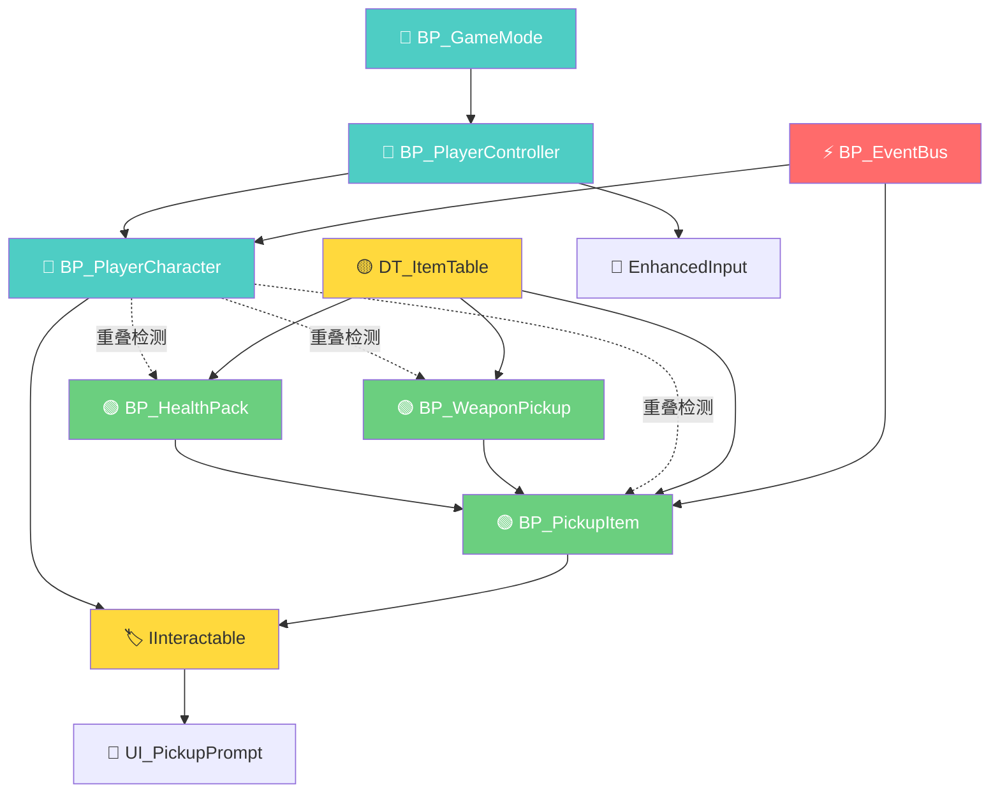
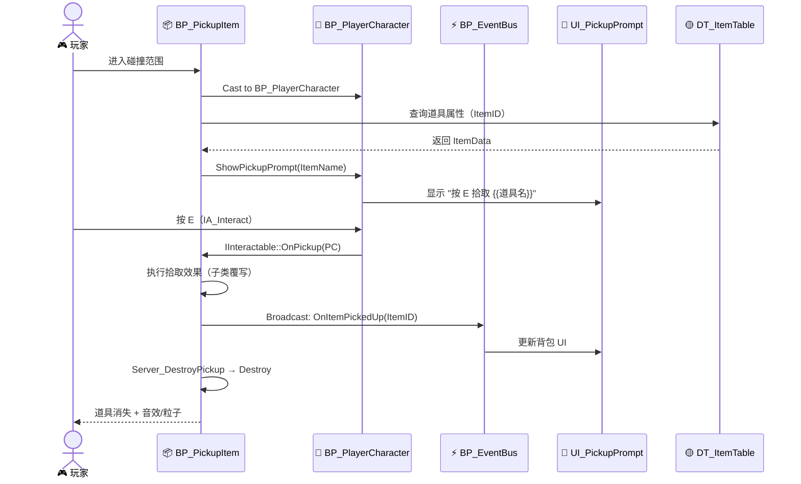
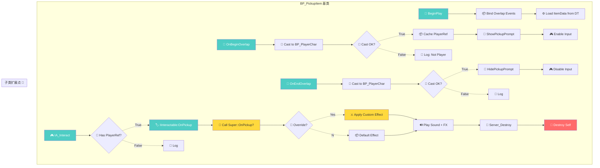
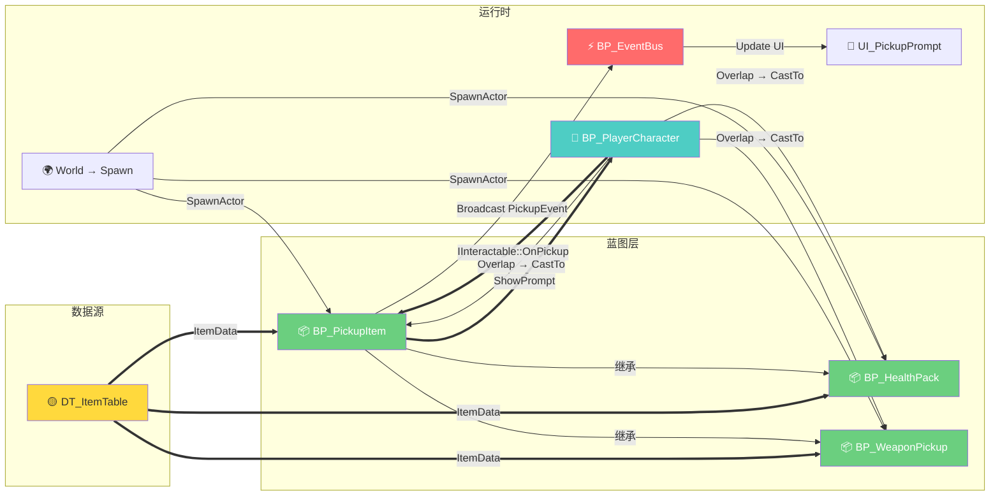
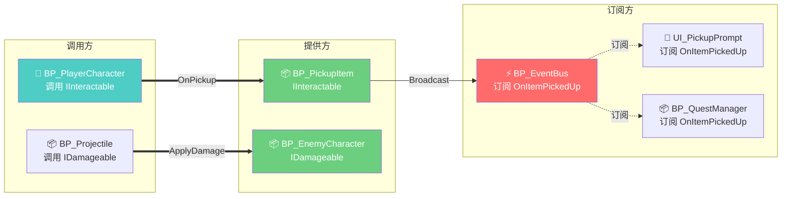
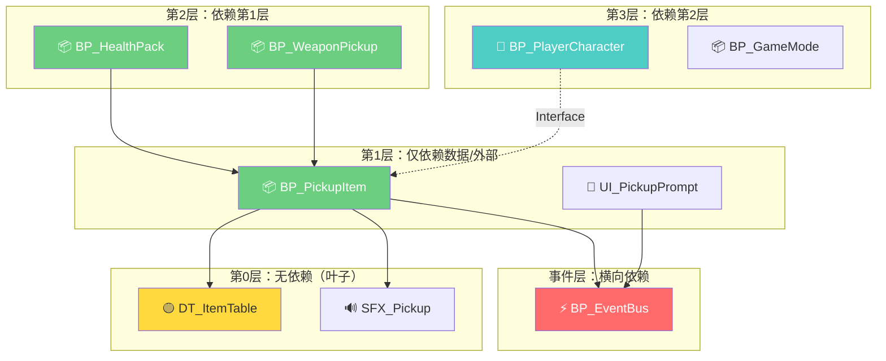
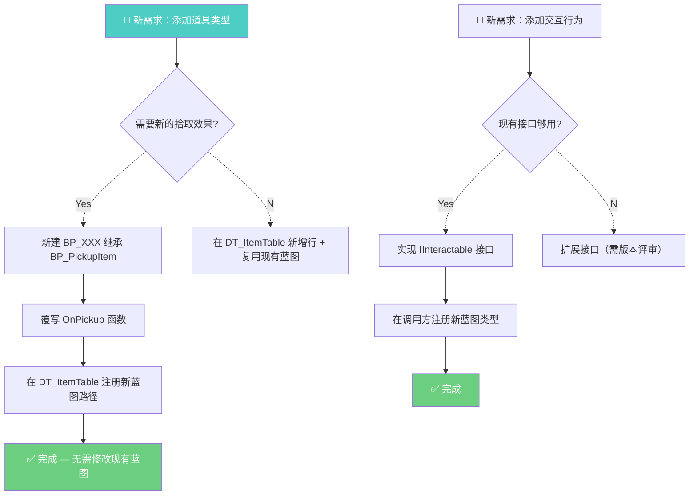
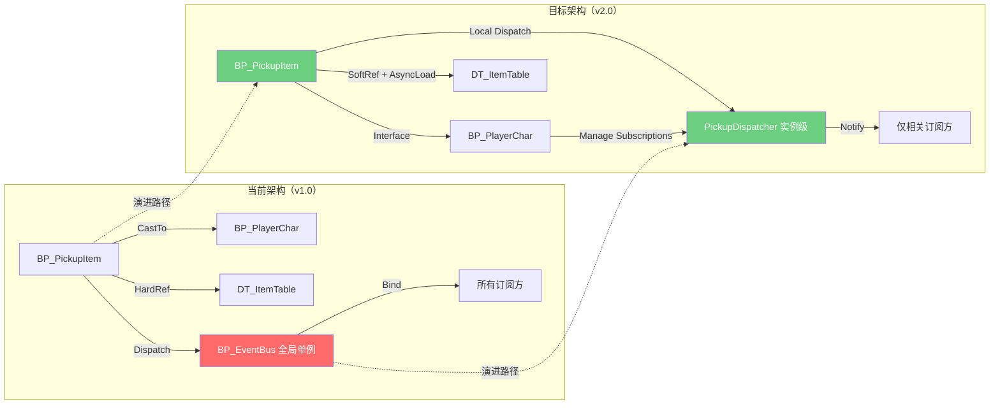

# UE5 蓝图系统架构报告

> **模板版本：** v1.0  
> **参考标准：** `templates/mermaid_tags.md` v1.0  
> **配合模块：** `scripts/mermaid_render.py`（SKILL-03）、`scripts/blueprint_reader.py`（analyzer）  
> **适用范围：** 多蓝图子系统/完整功能模块的架构级分析  
> **制定日期：** 2026-07-22  
> **制定 Agent：** docs-writer（调研写作）

---

## 使用说明

本模板用于从**系统架构**视角分析一组协作蓝图，而非单蓝图分析报告（后者使用 `analysis_report.md`）。

### 适用场景

- 跨蓝图子系统设计评审（如"道具拾取系统"、"敌人 AI 系统"、"UI 管理系统"）
- 重构前的架构摸底
- 新人交接时的系统全景文档
- 技术方案评审的架构证明

### 与 analyzer.py 的对接

本模板中标记 `<!--ANALYZER:AUTO-->` 的字段由 `blueprint_reader.py`（analyzer）自动填入，标记 `<!--MANUAL-->` 的字段需人工填写。

### 与 mermaid_render.py 的配合

所有图表使用 Mermaid 语法。报告完成后通过 `mermaid_render.py` 批量渲染为 PNG/SVG：

```bash
python scripts/mermaid_render.py --input architecture_report.md --output output/architecture/
```

---

## 报告头部

```markdown
# 蓝图系统架构报告：{{系统名称}}

| 项目 | 信息 |
|:---|:---|
| **报告 ID** | ARC-{{YYYYMMDD}}-{{序号}} |
| **系统名称** | {{SystemName}} |
| **覆盖蓝图** | {{N}} 个（详见 §2 模块清单） |
| **UE 版本** | {{5.x}} |
| **分析日期** | {{YYYY-MM-DD}} <!--ANALYZER:AUTO--> |
| **分析耗时** | {{N}} 秒 <!--ANALYZER:AUTO--> |
| **分析深度** | `full` / `basic` <!--ANALYZER:AUTO--> |
| **报告作者** | {{姓名}}（人工）/ docs-writer（模板生成） |
| **审核人** | {{姓名}} |
| **报告状态** | {{📝 草稿 / 🔍 评审中 / ✅ 已发布 / 🔄 已更新}} |
```

---

## 第一章：系统架构总览

> **目标：** 一页看清系统全貌——它由哪些蓝图组成、它们之间如何协作、对外暴露什么。

### 1.1 系统定位

| 维度 | 说明 |
|:---|:---|
| **系统角色** | {{在项目中的定位：核心系统 / 支撑系统 / 辅助系统 / 实验模块}} |
| **业务域** | {{所属业务领域：战斗 / 道具 / AI / UI / 音频 / 网络 / 存档 / ...}} |
| **设计范式** | {{事件驱动 / 数据驱动 / 状态机 / 行为树驱动 / 混合}} |
| **核心流程图** | `BP_{{主控蓝图}}` |

<!--MANUAL-->
> **一句话描述：** {{这个系统做什么——用不超过 50 字概括整个系统的核心职责。}}

### 1.2 架构拓扑图（Mermaid）

> **图例：** 🔵 主控蓝图 🟢 功能蓝图 🟡 数据蓝图 🔗 外部接口 ⚡ 事件总线



> **说明：** `BP_PickupItem` 及其子类（`BP_HealthPack`、`BP_WeaponPickup`）通过 `IInteractable` 接口与 `BP_PlayerCharacter` 交互；所有道具引用共享数据表 `DT_ItemTable`；`BP_EventBus`（标记 🔴）为全局事件单例，耦合度高待拆分。

### 1.3 架构模式识别

| 模式 | 是否使用 | 在哪些蓝图中体现 | 评价 |
|:---|:---:|:---|:---|
| **继承层次** | ✅ | `BP_PickupItem → BP_HealthPack / BP_WeaponPickup` | 🟢 合理 |
| **组合模式（Component）** | ✅ | `BP_EnemyController` 挂载 `UPawnSensingComponent` | 🟢 推荐 |
| **接口解耦** | ✅ | `IInteractable`、`IDamageable` | 🟢 健康 |
| **事件总线** | ⚠️ | `BP_EventBus`（全局单例） | 🟡 耦合风险 |
| **单例** | ❌ | — | — |
| **观察者/Dispatcher** | ✅ | `OnItemPickedUp` Dispatcher | 🟢 松耦合 |
| **工厂模式** | ❌ | — | 考虑引入 |
| **策略模式** | ❌ | — | 可用于 AI 行为切换 |

### 1.4 复杂度概要 <!--ANALYZER:AUTO-->

| 指标 | 值 | 评价 |
|:---|:---|:---|
| **蓝图总数** | `{{N}}` | — |
| **总节点数** | `{{N}}` | {🟢 轻量 (<200) / 🟡 中等 (200-1000) / 🔴 重型 (>1000)} |
| **总变量数** | `{{N}}` | — |
| **总连线数** | `{{N}}` | — |
| **接口实现数** | `{{N}}` | — |
| **事件 Dispatcher 数** | `{{N}}` | — |
| **父子层级深度** | `{{N}}` 层 | {🟢 ≤3 / 🟡 4-5 / 🔴 ≥6} |
| **循环依赖** | `{{N}}` 处 | {✅ 无 / 🔴 有，详见 §5.3} |

---

## 第二章：模块划分与职责

> **目标：** 逐一列出系统中的每个蓝图，明确职责边界，标注所有权。

### 2.1 模块清单

| # | 蓝图名称 | 类型 | 父类 | 角色 | 职责概述 | 节点数 | 所有权 |
|:---:|:---|:---|:---|:---|:---|---:|:---|
| 1 | `BP_PickupItem` | Actor | `Actor` | 🔵 主控 | 可拾取道具基类：碰撞检测、交互输入、拾取流程 | `{{N}}` | {{团队/个人}} |
| 2 | `BP_HealthPack` | Actor | `BP_PickupItem` | 🟢 功能 | 生命恢复道具：继承拾取逻辑、覆写效果 | `{{N}}` | {{团队/个人}} |
| 3 | `BP_WeaponPickup` | Actor | `BP_PickupItem` | 🟢 功能 | 武器拾取：继承拾取逻辑、覆写为换装 | `{{N}}` | {{团队/个人}} |
| 4 | `BP_PlayerCharacter` | Character | `ACharacter` | 🔵 主控 | 玩家角色：移动、输入、与交互系统对接 | `{{N}}` | {{团队/个人}} |
| 5 | `DT_ItemTable` | DataTable | — | 🟡 数据 | 道具属性表：名称、图标、价格、稀有度 | — | {{团队/个人}} |
| 6 | `BP_EventBus` | Actor | `AActor` | ⚡ 事件 | 全局事件单例：系统间消息转发 | `{{N}}` | {{团队/个人}} |
| … | … | … | … | … | … | … | … |

> **角色图例：** 🔵 主控蓝图（系统核心调度） 🟢 功能蓝图（子功能实现） 🟡 数据蓝图（DataAsset/DataTable/Curve） ⚡ 事件总线 🔗 外部接口

<!--MANUAL-->
### 2.2 各模块详细说明

#### 2.2.1 `BP_PickupItem`（基类）

| 维度 | 内容 |
|:---|:---|
| **核心职责** | 场景中可被玩家拾取的道具基类：检测玩家进入范围 → 显示 UI 提示 → 响应拾取输入 → 执行效果 → 自毁 |
| **不负责** | 具体效果逻辑（由子类覆写）；道具数据配置（由 DataTable 管理） |
| **公开接口** | `IInteractable::OnPickup(APlayerCharacter*)` |
| **依赖** | `BP_PlayerCharacter`（CastTo）、`DT_ItemTable`（DataTable 查询）、`BP_EventBus`（发布拾取事件） |
| **被依赖** | `BP_HealthPack`、`BP_WeaponPickup`（继承） |
| **生命周期** | Level 生成 → 等待玩家交互 → 拾取后自毁 |
| **网络角色** | Server Only（Destroy）；Client 通过 RepNotify 同步销毁 |

#### 2.2.2 `BP_EnemyController`（示例）

| 维度 | 内容 |
|:---|:---|
| **核心职责** | 控制敌方 AI 的巡逻、索敌与战斗决策，通过行为树驱动行为 |
| **不负责** | 具体移动实现（由 `UCharacterMovementComponent` 处理）；感知细节（由 `UAIPerceptionComponent` 提供） |
| **公开接口** | 无（内部通过 Blackboard 通信） |
| **依赖** | `BT_Combat`（行为树）、`BB_Enemy`（黑板）、`BP_EnemyCharacter`（控制的 Pawn） |
| **被依赖** | 无（叶子节点） |
| **生命周期** | 随控制的 Pawn 生成/销毁 |
| **网络角色** | Server Only（AI 始终在服务器运行） |

> ⚠️ 每个蓝图按此格式扩展。建议每个模块 5-10 行，高度压缩。

### 2.3 职责边界检查清单

| 检查项 | 状态 | 问题蓝图 | 说明 |
|:---|:---:|:---|:---|
| **单一职责**：每个蓝图只做一件事 | {{✅/⚠️}} | {{如有违反列出}} | {{说明}} |
| **无职责重叠**：没有两个蓝图做同样的事 | {{✅/⚠️}} | {{如有违反列出}} | {{说明}} |
| **无职责黑洞**：没有功能找不到归属蓝图 | {{✅/⚠️}} | {{如有违反列出}} | {{说明}} |
| **继承合理**：子类只扩展不推翻父类逻辑 | {{✅/⚠️}} | {{如有违反列出}} | {{说明}} |
| **组件优于继承**：优先使用 Component 而非深继承 | {{✅/⚠️}} | {{如有违反列出}} | {{说明}} |
| **接口优先**：蓝图间通信用 Interface 而非 CastTo | {{✅/⚠️}} | {{如有违反列出}} | {{说明}} |

---

## 第三章：数据流图（Mermaid）

> **引用标准：** `templates/mermaid_tags.md` v1.0  
> **渲染工具：** `scripts/mermaid_render.py`（SKILL-03）

### 3.1 系统级序列图（核心交互流程）

> 以「玩家拾取道具」为典型场景，展示跨蓝图消息传递。



> **关键观察：** 拾取流程中，`BP_PickupItem` 单向依赖 `BP_PlayerCharacter`（通过 CastTo），但 `BP_PlayerCharacter` 通过 `IInteractable` 接口反向调用——这是单向依赖 + 接口回调的经典模式。

### 3.2 系统级流程图（BP_PickupItem 视角）



> **🔧 扩展点标注：** `U`（Apply Custom Effect）为子类覆写点，`BP_HealthPack` 在此处恢复生命，`BP_WeaponPickup` 在此处添加武器到背包。

### 3.3 系统级流程图（BP_EnemyController 视角）

```mermaid
graph TD
    subgraph "BP_EnemyController：AI 决策循环"
        A[🚀 BeginPlay] --> B[⚙️ GetAIController]
        B --> C[🎯 Cast to BP_AIController]
        C --> D{🔀 Cast Succeeded?}
        D -.True.-> E[📦 Set OwnerRef]
        D -.False.-> F[📝 Log Error]
        E --> G[🧠 Run BT_Combat]

        G --> H[🏃 MoveTo PatrolPoint]
        H --> I[⏱️ Wait 5s]
        I --> J{🔀 Reached?}
        J -.True.-> K[🔄 Next PatrolIdx]
        J -.False.-> H
        K --> G
    end

    subgraph "事件驱动层：感知响应"
        L[🔔 OnEnemyDetected] --> M[⚙️ GetDistanceTo]
        M --> N{🔀 Within AggroRange?}
        N -.True.-> O[📦 Set TargetActor]
        N -.False.-> P[📝 Debug: Out of Range]
        O --> Q[⚔️ Engage]
        Q --> R[🧠 Switch BT_Combat → BT_Attack]

        S[🔔 OnEnemyLost] --> T[📦 Clear TargetActor]
        T --> U[🔄 BT_Attack → BT_Combat]
    end

    style A fill:#4ecdc4,color:#fff
    style L fill:#4ecdc4,color:#fff
    style S fill:#4ecdc4,color:#fff
    style G fill:#4ecdc4,color:#fff
    style R fill:#4ecdc4,color:#fff
    style Q fill:#ffd93d,color:#333
    style F fill:#ff6b6b,color:#fff
```



> **关键观察：** AI 系统采用**行为树驱动 + 事件覆盖**的混合范式。巡逻循环由行为树 `BT_Combat` 统一管理，而感知事件（`OnEnemyDetected` / `OnEnemyLost`）作为外部中断切换行为树状态。

### 3.4 数据流图：道具系统全景



### 3.5 色卡图例（贯穿全文）

```
图例：🔴阻断 🟡警告 🟢健康 🔵入口 ⚪未识别
连线：→ 执行流  ==> 数据流  ⇢ 条件分支  ⍭ 事件绑定
```

---

## 第四章：接口契约

> **目标：** 明确定义系统内部和外部的接口——谁提供、谁调用、什么约束。

### 4.1 接口清单

| # | 接口名称 | 类型 | 提供方 | 调用方 | 用途 | 版本 | 状态 |
|:---:|:---|:---|:---|:---|:---|:---:|:---:|
| 1 | `IInteractable` | Blueprint Interface | `BP_PickupItem` | `BP_PlayerCharacter` | 玩家交互拾取 | v1.0 | ✅ 稳定 |
| 2 | `IDamageable` | Blueprint Interface | `BP_EnemyCharacter` | `BP_Projectile` | 伤害接收 | v1.0 | ✅ 稳定 |
| 3 | `OnItemPickedUp` | Event Dispatcher | `BP_PickupItem` | `BP_EventBus`、`UI_PickupPrompt` | 拾取事件通知 | v1.0 | 🟡 待优化 |
| 4 | `OnEnemyDetected` | Custom Event（内部） | `BP_EnemyController` | （仅内部使用） | AI 感知回调 | v1.0 | ✅ 稳定 |
| 5 | `OnEnemyLost` | Custom Event（内部） | `BP_EnemyController` | （仅内部使用） | AI 丢失目标回调 | v1.0 | ✅ 稳定 |
| … | … | … | … | … | … | … | … |

> **接口类型：** Blueprint Interface / Event Dispatcher / Custom Event / RPC / Delegate

### 4.2 接口详细契约

#### 4.2.1 `IInteractable`

```
接口名称：IInteractable
提供方：BP_PickupItem（及所有子类）、BP_Door、BP_Terminal
调用方：BP_PlayerCharacter
版本：v1.0
稳定性：✅ 稳定（已锁定，不建议修改）

━━━ 函数签名 ━━━

  OnPickup(APlayerCharacter* Picker) → void
    描述：玩家与该 Actor 交互时调用。由调用方保证 Picker 非空。
    前置条件：Picker != nullptr，Picker 在交互范围内
    后置条件：具体效果由实现方决定（拾取/开门/对话...）
    副作用：可能触发 Actor 销毁、播放音效/粒子、更新 UI
    网络：在 Server 上执行；实现方负责 Replication

  OnFocus() → void
    描述：玩家准星指向该 Actor 时调用，用于显示高亮/提示。
    前置条件：无
    后置条件：调用方应在 OnUnfocus 调用前不再重复调用
    副作用：启用/禁用 Outline 效果

  OnUnfocus() → void
    描述：玩家准星移开该 Actor 时调用。
    前置条件：已调用过 OnFocus()
    后置条件：高亮效果已移除

━━━ 调用约定 ━━━

  • 调用方必须 CastTo 验证后再调用（不可 Blind Call）
  • OnPickup 调用后，调用方应清除对该 Actor 的所有引用（可能已销毁）
  • 所有函数均为 BlueprintCallable + BlueprintNativeEvent（允许 C++ 和蓝图双重实现）
```

#### 4.2.2 `OnItemPickedUp` Event Dispatcher

```
Dispatcher 名称：OnItemPickedUp
所属蓝图：BP_PickupItem
版本：v1.0
稳定性：🟡 待优化（全局事件总线耦合）

━━━ 签名 ━━━

  OnItemPickedUp(int32 ItemID, FString ItemName, EItemType ItemType)
    参数：
      ItemID —— 被拾取道具的唯一 ID（来自 DT_ItemTable）
      ItemName —— 道具显示名（如 "医疗包"）
      ItemType —— 道具类型枚举（Health / Weapon / Armor / ...）

━━━ 绑定关系 ━━━

  BP_EventBus     → OnItemPickedUp → 广播到各子系统
  UI_PickupPrompt → OnItemPickedUp → 显示拾取弹出
  BP_QuestManager → OnItemPickedUp → 任务进度更新

━━━ 优化建议 ━━━

  ⚠️ 当前通过 BP_EventBus 全局单例中转，存在以下问题：
    1. BP_EventBus 成为单点故障
    2. 任何蓝图都可绑定，缺乏调用权限控制
    3. 调试时难以追踪事件来源
  
  建议：
    • 短期：添加调试日志，记录每次 Broadcast 的调用栈
    • 长期：改为 Local Dispatcher（每个 BP_PickupItem 实例自己的 Dispatcher）+ 
            PlayerController 统一管理订阅
```

### 4.3 接口依赖拓扑



### 4.4 接口版本历史

| 接口 | 版本 | 日期 | 变更内容 | 影响评估 |
|:---|:---|:---|:---|:---|
| `IInteractable` | v1.0 | 2026-07-01 | 初始定义：OnPickup + OnFocus + OnUnfocus | — |
| `IDamageable` | v1.0 | 2026-06-15 | 初始定义：ApplyDamage + GetHealth | — |
| `OnItemPickedUp` | v1.0 | 2026-07-10 | 初始定义 | 需改为非全局方式 |

---

## 第五章：依赖关系矩阵

> **目标：** 量化蓝图间耦合程度，发现架构异味。

### 5.1 依赖矩阵（N × N）

> **读法：** 行 = 依赖方（Depender），列 = 被依赖方（Dependee）。  
> `✅` = 健康依赖（接口/事件/软引用），`🟡` = 警告依赖（CastTo/硬引用），`🔗` = 继承关系。

<!--ANALYZER:AUTO-->
| Depender ↓ / Dependee → | BP_PickupItem | BP_HealthPack | BP_WeaponPickup | BP_PlayerChar | BP_EnemyCtrl | DT_ItemTable | BP_EventBus |
|:---|:---:|:---:|:---:|:---:|:---:|:---:|:---:|
| **BP_PickupItem** | — | — | — | 🟡 CastTo | — | 🟡 HardRef | ✅ Dispatch |
| **BP_HealthPack** | 🔗 Parent | — | — | 🟡 CastTo | — | 🟡 HardRef | — |
| **BP_WeaponPickup** | 🔗 Parent | — | — | 🟡 CastTo | — | 🟡 HardRef | — |
| **BP_PlayerCharacter** | ✅ Interface | — | — | — | — | — | — |
| **BP_EnemyController** | — | — | — | — | — | — | — |
| **BP_EventBus** | ✅ Bind | ✅ Bind | ✅ Bind | ✅ Bind | — | — | — |
| **UI_PickupPrompt** | — | — | — | — | — | — | ✅ Bind |

> **指标：** 总依赖数 `{{N}}` · 健康 `{{N}}` ({{N}}%) · 警告 `{{N}}` ({{N}}%) · 阻断 `{{N}}` ({{N}}%)

### 5.2 依赖分类统计 <!--ANALYZER:AUTO-->

| 依赖类型 | 数量 | 占比 | 说明 |
|:---|---:|---:|:---|
| **🔗 继承** | `{{N}}` | `{{N}}%` | 子 → 父，单向健康 |
| **✅ 接口调用** | `{{N}}` | `{{N}}%` | 松耦合，推荐 |
| **✅ Event Dispatcher** | `{{N}}` | `{{N}}%` | 松耦合，推荐 |
| **🟡 CastTo** | `{{N}}` | `{{N}}%` | 硬类引用，建议改为接口 |
| **🟡 硬引用（Object Ref）** | `{{N}}` | `{{N}}%` | 加载时全部进内存，建议改为 Soft Ref |
| **🔴 循环依赖** | `{{N}}` | `{{N}}%` | 必须修复 |
| **总计** | `{{N}}` | 100% | — |

### 5.3 循环依赖检测 <!--ANALYZER:AUTO-->

| 结果 | 详情 |
|:---|:---|
| ✅ 未检测到循环依赖 | — |
| 或 🔴 检测到 `{{N}}` 处循环依赖 | 示例：`BP_A → BP_B → BP_A` |

### 5.4 依赖深度图（Mermaid）



> **最大依赖深度：** `{{N}}` 层。{🟢 ≤3 / 🟡 4-5 / 🔴 ≥6}

### 5.5 高耦合热点

<!--ANALYZER:AUTO-->
| 蓝图 | 入度（被多少人依赖） | 出度（依赖多少人） | 耦合评分 | 建议 |
|:---|:---:|:---:|:---|:---|
| `BP_PickupItem` | `{{N}}` | `{{N}}` | {{🟢/🟡/🔴}} | {{建议}} |
| `BP_EventBus` | `{{N}}` | `{{N}}` | {{🟢/🟡/🔴}} | {{建议}} |
| `DT_ItemTable` | `{{N}}` | 0 | {{🟢/🟡/🔴}} | {{建议}} |

---

## 第六章：扩展点与约束

> **目标：** 明确系统的可扩展边界和技术债务，指导未来开发。

### 6.1 扩展点地图

| # | 扩展点 | 位置 | 扩展方式 | 示例 | 稳定性 | 文档 |
|:---:|:---|:---|:---|:---|:---:|:---:|
| 1 | **道具效果覆写** | `BP_PickupItem::OnPickup` | 子类覆写 `Super::OnPickup` | `BP_HealthPack` 覆写为恢复生命 | ✅ 稳定 | §4.2.1 |
| 2 | **新道具类型** | — | 继承 `BP_PickupItem`，在 `DT_ItemTable` 注册 | 新增 `BP_ArmorPickup` | ✅ 稳定 | §2.2.1 |
| 3 | **AI 行为切换** | `BP_EnemyController::OnEnemyDetected` | 行为树分支 + Blackboard 键值 | 新增逃跑行为 `BT_Flee` | 🟡 待完善 | §3.3 |
| 4 | **新交互类型** | `IInteractable` 接口 | 实现接口 + 在调用方注册 | 新增 `BP_Terminal` 实现对话交互 | ✅ 稳定 | §4.2.1 |
| 5 | **全局事件** | `BP_EventBus` | 新增 Dispatcher 绑定 | 新增成就系统订阅拾取事件 | 🔴 不建议扩展 | §4.2.2 |
| … | … | … | … | … | … | … |

### 6.2 推荐扩展路径



### 6.3 约束清单

#### 6.3.1 硬性约束（不可违反）

| # | 约束 | 范围 | 理由 | 检测方式 |
|:---:|:---|:---|:---|:---|
| 1 | **禁止循环依赖** | 全局 | 导致编译失败或运行时死锁 | `analyzer.py` 自动检测 |
| 2 | **接口不得频繁变更** | `IInteractable` | 所有道具蓝图依赖此接口 | Code Review + 版本锁定 |
| 3 | **禁止在 Tick 中访问 DataTable** | 所有动态蓝图 | 性能灾难 | `analyzer.py` 检测 |
| 4 | **网络 RPC 必须标记 Reliable/Unreliable** | 所有 RPC 函数 | 防止丢包导致逻辑错误 | 人工检查 |
| 5 | **禁止 Blueprint 之间直接访问私有变量** | 全局 | 破坏封装性 | `analyzer.py` 检测 |

#### 6.3.2 软性约束（建议遵守）

| # | 约束 | 范围 | 理由 | 豁免条件 |
|:---:|:---|:---|:---|:---|
| 1 | **优先使用接口而非 CastTo** | 全局 | 降低耦合 | 性能热点（CastTo 快于接口查询） |
| 2 | **优先使用 Soft Reference 而非硬引用** | 全局 | 减少内存占用 | 核心依赖且不会变更的资产 |
| 3 | **单个蓝图节点数 ≤ 200** | 全局 | 可读性和可维护性 | 有充分注释和文档 |
| 4 | **继承深度 ≤ 3 层** | 全局 | 避免深层继承难以调试 | 每层增加父类调用说明 |
| 5 | **全局 Event Dispatcher ≤ 5 个** | `BP_EventBus` | 避免事件风暴 | 有事件日志和监控 |

### 6.4 技术债务登记

| # | 债务 | 位置 | 影响 | 优先级 | 预计工作量 | 计划修复日期 |
|:---:|:---|:---|:---|:---:|:---|:---|
| 1 | `BP_EventBus` 全局单例耦合 | `BP_EventBus` | 单点故障、调试困难 | 🟡 中 | 4h | 2026-08-15 |
| 2 | `BP_PickupItem` 中 CastTo 可改为接口 | `BP_PickupItem` | 增加 `BP_PlayerCharacter` 耦合 | 🟡 中 | 2h | 2026-08-01 |
| 3 | `DT_ItemTable` 硬引用过多 | 所有道具蓝图 | 内存常驻 | 🟢 低 | 1h | 有空时 |
| … | … | … | … | … | … | … |

### 6.5 架构演进建议



> **v1.0 → v2.0 关键变化：**
> 1. CastTo → Interface：降低 `BP_PickupItem` 与 `BP_PlayerCharacter` 的直接耦合
> 2. HardRef → SoftRef + AsyncLoad：道具系统数据表按需加载，减少常驻内存
> 3. 全局 EventBus → 实例级 Dispatcher：每个 `BP_PickupItem` 管理自己的事件，由 `BP_PlayerCharacter` 统一订阅管理

---

## 附录 A：自动化数据对接字段

> 以下字段由 `blueprint_reader.py`（analyzer）自动填入，在手动填写模板时可保留占位符。

### A.1 蓝图基本信息集合 <!--ANALYZER:AUTO-->

```json
{
  "system_name": "{{SystemName}}",
  "blueprints": [
    {
      "name": "{{BlueprintName}}",
      "asset_path": "{{/Game/Path}}",
      "parent_class": "{{ParentClass}}",
      "blueprint_type": "{{Actor/Widget/Component/...}}",
      "node_count": {{N}},
      "variable_count": {{N}},
      "connection_count": {{N}},
      "interface_count": {{N}},
      "dispatcher_count": {{N}},
      "complexity_score": {{N}},
      "degrade_level": "{{L1/L2/L3}}"
    }
  ],
  "global_metrics": {
    "total_nodes": {{N}},
    "total_variables": {{N}},
    "total_connections": {{N}},
    "max_dependency_depth": {{N}},
    "cyclic_dependency_count": {{N}},
    "cast_to_count": {{N}},
    "hard_ref_count": {{N}},
    "soft_ref_count": {{N}},
    "interface_call_count": {{N}},
    "event_bind_count": {{N}}
  }
}
```

### A.2 依赖矩阵数据 <!--ANALYZER:AUTO-->

```json
{
  "dependency_matrix": [
    {
      "from": "{{BlueprintName}}",
      "to": "{{BlueprintName}}",
      "type": "{{Inheritance/CastTo/HardRef/SoftRef/Interface/EventBind}}",
      "is_cyclic": {{true/false}},
      "note": "{{说明}}"
    }
  ]
}
```

### A.3 复杂度指标 <!--ANALYZER:AUTO-->

```json
{
  "complexity_metrics": {
    "per_blueprint": [
      {
        "name": "{{BlueprintName}}",
        "node_count": {{N}},
        "branch_density": {{N}}%,
        "max_depth": {{N}},
        "event_entry_count": {{N}},
        "coupling_in": {{N}},
        "coupling_out": {{N}},
        "complexity_rating": "{{🟢/🟡/🔴}}"
      }
    ]
  }
}
```

---

## 附录 B：Mermaid 图表清单

> 本报告中共包含 `{{N}}` 个 Mermaid 图表。可使用 `scripts/mermaid_render.py` 批量渲染。

| # | 章节 | 图表类型 | 描述 | Mermaid 语法块行号 |
|:---:|:---|:---|:---|:---:|
| 1 | §1.2 | `graph TD` | 架构拓扑图 | L{{N}} |
| 2 | §3.1 | `sequenceDiagram` | 玩家拾取道具序列图 | L{{N}} |
| 3 | §3.2 | `graph TD` | BP_PickupItem 流程图 | L{{N}} |
| 4 | §3.3 | `graph TD` | BP_EnemyController 流程图 | L{{N}} |
| 5 | §3.4 | `graph LR` | 道具系统数据流全景 | L{{N}} |
| 6 | §4.3 | `graph LR` | 接口依赖拓扑 | L{{N}} |
| 7 | §5.4 | `graph TD` | 依赖深度图 | L{{N}} |
| 8 | §6.2 | `graph TD` | 推荐扩展路径 | L{{N}} |
| 9 | §6.5 | `graph LR` | 架构演进路线 | L{{N}} |

---

## 附录 C：报告元数据

| 字段 | 值 |
|:---|:---|
| **报告 ID** | `{{report_id}}` <!--ANALYZER:AUTO--> |
| **生成工具** | `ue5-automation` v0.1 |
| **分析耗时** | `{{N}}` 秒 <!--ANALYZER:AUTO--> |
| **数据来源** | `blueprint_reader.py` L{{1/2/3}} <!--ANALYZER:AUTO--> |
| **图表渲染** | `mermaid_render.py`（SKILL-03） |
| **分析 Agent** | dev（数据采集）+ docs-writer（报告输出） |
| **审核 Agent** | {{质量审核}} |

---

> **声明：** 本报告由 `ue5-automation` 系统生成。所有 `⚠️ 待确认` 标记项须人工验证后方可作为决策依据。完整输出物规范见 `SKILL.md` v1.0。

---

## 附录 D：模板占位符速查

| 占位符 | 说明 |
|:---|:---|
| `{{系统名称}}` / `{{SystemName}}` | 分析的系统/子系统名称 |
| `{{BlueprintName}}` | 蓝图资产名（不含路径） |
| `{{N}}` / `{{Total}}` | 数值型占位符，由 analyzer.py 自动填入 |
| `{{N}}%` | 百分比占位符 |
| `{{YYYY-MM-DD}}` | 日期占位符 |
| `<!--ANALYZER:AUTO-->` | 标记由 analyzer.py 自动填入的字段 |
| `<!--MANUAL-->` | 标记需人工填写的字段 |
| `{{🟢/🟡/🔴}}` | 三选一或 N 选一的选项型占位符 |

---

> **模板版本：** v1.0 · 2026-07-22 · docs-writer（调研写作 Agent）  
> **配套文件：** `templates/mermaid_tags.md` v1.0 · `templates/analysis_report.md` v1.0 · `templates/creation_plan.md` v1.0 · `scripts/mermaid_render.py` · `scripts/blueprint_reader.py`
