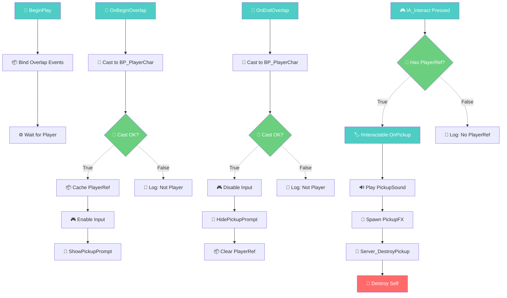

# UE5 蓝图创建方案模板

> **模板版本：** v1.0  
> **参考标准：** `templates/mermaid_tags.md` v1.0  
> **适用范围：** 新建蓝图的方案设计与实施跟踪  
> **制定日期：** 2026-07-22  
> **制定 Agent：** docs-writer

---

## 使用说明

本模板用于在动手创建蓝图前进行方案设计，并在实施后记录实际结果。使用时：

1. **「方案设计」阶段**（第 1–5 章）：创建前填写，用于评审和确认
2. **「实施记录」阶段**（第 6 章）：创建完成后填写实际结果
3. **流程图必须遵守** `templates/mermaid_tags.md` 中的标签/连线/颜色标准
4. **示例参考**：本文档末尾附有 `BP_PickupItem` 的完整示例（第 7 节）

---

## 报告头部

```markdown
# 蓝图创建方案：{{蓝图名称}}

| 项目 | 信息 |
|:---|:---|
| **方案 ID** | PLN-{{日期}}-{{序号}} |
| **蓝图名称** | {{BlueprintName}} |
| **目标路径** | {{/Game/Blueprints/...}} |
| **蓝图类型** | {{Actor / ActorComponent / Widget / ...}} |
| **父类** | {{ParentClass}} |
| **创建者** | {{姓名}} |
| **方案日期** | {{YYYY-MM-DD}} |
| **实施日期** | {{YYYY-MM-DD（待定 / 已完成）}} |
| **UE 版本** | {{5.x}} |
| **方案状态** | {{📝 草稿 / ✅ 已确认 / 🏗️ 实施中 / ✔️ 已完成}} |
```

---

## 第一章：需求理解摘要

> **目标：** 用自然语言描述「要做什么」，确保方案评审者能快速判断方案是否偏离需求。

### 1.1 需求来源

| 来源 | 内容 |
|:---|:---|
| **需求提出方** | {{策划 / 程序 / 美术 / 自己}} |
| **关联文档** | {{需求文档链接 / PRD / 飞书文档链接}} |
| **关联蓝图** | {{已有蓝图的路径或名称}} |

### 1.2 功能描述

> **一句话：** {{这个蓝图做什么？}}

| 维度 | 说明 |
|:---|:---|
| **玩家视角** | {{玩家看到的/交互到的行为}} |
| **系统视角** | {{在系统架构中的角色：数据层/表现层/逻辑层/...}} |
| **触发条件** | {{什么情况下创建/激活这个蓝图？}} |
| **生命周期** | {{创建 → 运作 → 销毁的完整过程}} |

### 1.3 边界约束

| 约束项 | 内容 |
|:---|:---|
| **性能预算** | {{Tick 频率限制 / 最大节点数 / 内存上限}} |
| **网络要求** | {{单机 / 客户端 / 服务器 / 复制策略}} |
| **兼容性** | {{需兼容的 UE 版本 / 平台 / 已有系统}} |
| **依赖限制** | {{禁止使用的外部插件或系统}} |

---

## 第二章：文字步骤

> **目标：** 用「做什么 + 用什么 API」的结构写出每一步，让执行者无需反复查阅 UE 编辑器即可按步骤实施。

### 步骤格式

```
步骤 N：【{{步骤名称}}】
  - 做什么：{{一句话描述这一步的目标}}
  - 用什么 API：`{{UClassName::FunctionName}}` / `{{Blueprint Node Name}}`
  - 输入：{{输入数据 / 参数}}
  - 输出：{{输出数据 / 副作用}}
  - 备注：{{注意事项 / 替代方案}}
```

### 步骤清单

```
步骤 1：【{{初始化}}】
  - 做什么：
  - 用什么 API：
  - 输入：
  - 输出：
  - 备注：

步骤 2：【{{步骤名称}}】
  ...

步骤 N：【{{清理/销毁}}】
  - 做什么：
  - 用什么 API：
  - 输入：
  - 输出：
  - 备注：
```

---

## 第三章：Mermaid 流程图

> **引用标准：** `templates/mermaid_tags.md` v1.0  
> **要求：** emoji + 中文标注、连线标注路径名、入口节点蓝底、颜色标注问题/警告节点。

### 3.1 主流程图

```mermaid
graph TD
    {{Mermaid 源码 — emoji 标签 + 中文描述}}
```

### 3.2 关键子图（如有）

#### {{子图名称}}

```mermaid
graph TD
    {{Mermaid 源码}}
```

### 3.3 色卡图例

```
图例：🔴阻断 🟡警告 🟢健康 🔵入口 ⚪未识别
```

---

## 第四章：节点/变量设计表

### 4.1 变量设计

| 变量名 | 类型 | 默认值 | 可见性 | Category | 用途 | 标记 |
|:---|:---|:---|:---|:---|:---|:---:|
| `{{VarName}}` | `{{Type}}` | `{{Default}}` | {{Public/Private}} | {{Category}} | {{用途说明}} | {{新增 / 继承}} |

> **标记说明：**  
> `新增` = 本蓝图新创建的变量  
> `继承` = 从父类继承的变量（本蓝图使用但不创建）

### 4.2 事件/函数设计

| 名称 | 类型 | 访问修饰符 | 输入参数 | 返回值 | 用途 |
|:---|:---|:---|:---|:---|:---|
| `{{EventName}}` | {{Event / Custom Event}} | — | `{{Param: Type}}` | — | {{说明}} |
| `{{FuncName}}` | {{Function / Pure}} | {{Public/Protected/Private}} | `{{Param: Type}}` | `{{RetType}}` | {{说明}} |

### 4.3 接口设计（如有）

| 接口名称 | 实现函数 | 触发方 | 说明 |
|:---|:---|:---|:---|
| `{{IInterface}}` | `{{事件/函数名}}` | {{谁调用这个接口}} | {{说明}} |

---

## 第五章：用户确认清单

> **目标：** 在动手创建蓝图前，逐项确认关键设计决策。确认人逐项打勾。

| 序号 | 检查项 | 状态 | 确认人 | 备注 |
|:---:|:---|:---:|:---|:---|
| 1 | **父类选择正确** — {{ParentClass}} 是最合适的基类 | ☐ | | |
| 2 | **接口定义明确** — 所有接口函数已声明参数和返回值 | ☐ | | |
| 3 | **变量类型安全** — 无 Object 通类型、无不必要的 Public | ☐ | | |
| 4 | **流程图审查通过** — 流程无死循环、无孤立节点 | ☐ | | |
| 5 | **性能评估通过** — Tick 逻辑已最小化、无不必要轮询 | ☐ | | |
| 6 | **网络策略明确** — 已确定 Replicated/NotReplicated 范围 | ☐ | | |
| 7 | **依赖关系清晰** — 所有外部引用已列出且路径有效 | ☐ | | |
| 8 | **命名规范合规** — 蓝图名/变量名/函数名符合项目命名规范 | ☐ | | |
| 9 | **边界条件覆盖** — 空指针/空数组/未初始化等边界已处理 | ☐ | | |
| 10 | **日志/调试预留** — 关键路径有日志输出或调试开关 | ☐ | | |

---

## 第六章：实施记录表

> **目标：** 蓝图创建完成后，如实记录创建了哪些节点、连线、编译结果。

### 6.1 实施概况

| 项目 | 值 |
|:---|:---|
| **实施日期** | {{YYYY-MM-DD}} |
| **实施耗时** | {{N}} 分钟 |
| **实际节点数** | {{N}} |
| **实际变量数** | {{N}} |
| **与方案偏差** | {{无 / 偏差说明}} |

### 6.2 创建的节点

| 序号 | 节点 | 标签 | 所在事件图/函数 | 说明 |
|:---:|:---|:---:|:---|:---|
| 1 | `{{NodeName}}` | {{emoji}} | `{{GraphName}}` | {{说明}} |

### 6.3 创建的连线

| 序号 | 起点 | 终点 | 线型 | 说明 |
|:---:|:---|:---|:---:|:---|
| 1 | `{{NodeA}}` | `{{NodeB}}` | → / ⇒ / ⇢ / ⍭ | {{说明}} |

### 6.4 编译结果

| 项目 | 结果 |
|:---|:---|
| **首次编译** | {{✅ 通过 / ❌ 失败 / ⚠️ 警告 {{N}} 条}} |
| **编译警告** | {{逐条列出警告内容及其位置}} |
| **最终编译** | {{✅ 通过}} |
| **功能测试** | {{✅ 通过 / ⚠️ 部分通过 / ❌ 未测试}} |
| **测试备注** | {{测试方法、发现的 bug、已知限制}} |

### 6.5 偏差记录

| 章节 | 方案设计 | 实际实施 | 原因 |
|:---|:---|:---|:---|
| {{章节}} | {{原方案}} | {{实际}} | {{为什么改}} |

---

## 第七章：完整示例 — BP_PickupItem

> 以下是一个基于本模板的完整填写示例，展示各章节的最终形态。

---

### 报告头部（示例）

```markdown
# 蓝图创建方案：BP_PickupItem

| 项目 | 信息 |
|:---|:---|
| **方案 ID** | PLN-20260722-001 |
| **蓝图名称** | BP_PickupItem |
| **目标路径** | /Game/Blueprints/Items/BP_PickupItem |
| **蓝图类型** | Actor |
| **父类** | Actor |
| **创建者** | 陈万科 |
| **方案日期** | 2026-07-22 |
| **实施日期** | 2026-07-22 |
| **UE 版本** | 5.1 |
| **方案状态** | ✔️ 已完成 |
```

---

### 第一章：需求理解摘要（示例）

#### 1.1 需求来源

| 来源 | 内容 |
|:---|:---|
| **需求提出方** | 策划 |
| **关联文档** | 道具系统 PRD v2.1 |
| **关联蓝图** | `BP_PlayerCharacter`（拾取方） |

#### 1.2 功能描述

> **一句话：** 场景中可被玩家拾取的道具，拾取后触发效果并自毁。

| 维度 | 说明 |
|:---|:---|
| **玩家视角** | 走近道具 → 看到拾取提示 → 按键拾取 → 道具消失并触发效果 |
| **系统视角** | 表现层 + 逻辑层：检测重叠、响应输入、调用效果接口、销毁自身 |
| **触发条件** | 玩家角色进入碰撞范围 + 按下交互键 |
| **生命周期** | Level 加载时生成 → 等待重叠 → 拾取触发 → 自毁 |

#### 1.3 边界约束

| 约束项 | 内容 |
|:---|:---|
| **性能预算** | 无 Tick，纯事件驱动 |
| **网络要求** | 服务器销毁，Replicated |
| **兼容性** | UE 5.1.x（随包桥实测版本；其他版本见 `UE_VERSION_GUIDE.md`）、与 `IInteractable` 接口系统兼容 |
| **依赖限制** | 不依赖 GameMode 或 GameState |

---

### 第二章：文字步骤（示例）

```
步骤 1：【初始化组件】
  - 做什么：在构造函数中创建 SphereCollision 和 StaticMesh 组件
  - 用什么 API：`UActor::CreateDefaultSubobject<T>`
  - 输入：无
  - 输出：已挂载的 `UStaticMeshComponent` + `USphereComponent`
  - 备注：碰撞体设为 OverlapAll 通道

步骤 2：【绑定重叠事件】
  - 做什么：BeginPlay 时绑定 OnComponentBeginOverlap / EndOverlap
  - 用什么 API：`USphereComponent::OnComponentBeginOverlap.AddDynamic`
  - 输入：`this, &ABP_PickupItem::OnOverlapBegin`
  - 输出：事件绑定完成
  - 备注：同时绑定 EndOverlap 以清除提示

步骤 3：【检测玩家角色】
  - 做什么：碰撞回调中 Cast 为 BP_PlayerCharacter
  - 用什么 API：`AActor::GetClass()->IsChildOf(...)` 或 `Cast<ABP_PlayerCharacter>`
  - 输入：`AActor* OtherActor`
  - 输出：`ABP_PlayerCharacter* Player` 或 nullptr
  - 备注：Cast 失败则静默返回

步骤 4：【显示拾取提示】
  - 做什么：玩家进入碰撞范围时显示 UI 提示
  - 用什么 API：`ABP_PlayerCharacter::ShowPickupPrompt(FString ItemName)`
  - 输入：`ItemName`（本蓝图的 `ItemDisplayName` 变量）
  - 输出：UI 显示 "按 E 拾取 XX"
  - 备注：离开范围时调用 `HidePickupPrompt`

步骤 5：【处理拾取输入】
  - 做什么：EnableInput / DisableInput 根据玩家是否在范围内切换
  - 用什么 API：`APlayerController::EnableInput` / `DisableInput`
  - 输入：无
  - 输出：玩家按下交互键时触发自定义事件
  - 备注：使用 EnhancedInput Action `IA_Interact`

步骤 6：【执行拾取逻辑】
  - 做什么：调用接口方法应用效果 → 播放拾取粒子/音效 → 自毁
  - 用什么 API：`IInteractable::Execute_OnPickup`、`UGameplayStatics::SpawnEmitterAtLocation`、`AActor::Destroy`
  - 输入：拾取方 `ABP_PlayerCharacter*`
  - 输出：效果生效 + 自身销毁
  - 备注：先应用效果再播放特效，确保效果优先

步骤 7：【网络复制处理】
  - 做什么：服务器 RPC 触发销毁，确保所有客户端同步
  - 用什么 API：`Server_DestroyPickup`（自定义 Server RPC）
  - 输入：无
  - 输出：多端同步销毁
  - 备注：RPC 需标记为 Reliable
```

---

### 第三章：Mermaid 流程图（示例）

#### 3.1 主流程图



#### 3.2 色卡图例

```
图例：🔴阻断 🟡警告 🟢健康 🔵入口 ⚪未识别
```

---

### 第四章：节点/变量设计表（示例）

#### 4.1 变量设计

| 变量名 | 类型 | 默认值 | 可见性 | Category | 用途 | 标记 |
|:---|:---|:---|:---|:---|:---|:---:|
| `ItemDisplayName` | `FString` | `"Unknown Item"` | Public | Pickup | 拾取提示中显示的道具名 | 新增 |
| `ItemType` | `EItemType` | `EItemType::Health` | Public | Pickup | 道具类型枚举 | 新增 |
| `PickupValue` | `float` | 25.0 | Public | Pickup | 拾取效果数值（生命值/护甲等） | 新增 |
| `PickupSound` | `USoundBase*` | `nullptr` | Public | Pickup | 拾取音效 | 新增 |
| `PickupEffect` | `UParticleSystem*` | `nullptr` | Public | Pickup | 拾取粒子特效 | 新增 |
| `CachedPlayerRef` | `ABP_PlayerCharacter*` | `nullptr` | Private | Pickup | 缓存的玩家引用 | 新增 |
| `bCanInteract` | `bool` | `false` | Private | Pickup | 是否可交互（玩家在范围内） | 新增 |

#### 4.2 事件/函数设计

| 名称 | 类型 | 访问修饰符 | 输入参数 | 返回值 | 用途 |
|:---|:---|:---|:---|:---|:---|
| `OnBeginOverlap` | Event | — | `AActor* OtherActor` | — | 碰撞开始回调 |
| `OnEndOverlap` | Event | — | `AActor* OtherActor` | — | 碰撞结束回调 |
| `IA_Interact` | Event | — | — | — | EnhancedInput 交互按键 |
| `OnPickup` | Interface Event | Public | `APlayerCharacter* Picker` | — | 实现 IInteractable 接口 |
| `Server_DestroyPickup` | Server RPC | Private | — | — | 服务器授权销毁 |

#### 4.3 接口设计

| 接口名称 | 实现函数 | 触发方 | 说明 |
|:---|:---|:---|:---|
| `IInteractable` | `OnPickup(APlayerCharacter*)` | `IA_Interact` 按键事件 | 执行拾取效果逻辑 |

---

### 第五章：用户确认清单（示例）

| 序号 | 检查项 | 状态 | 确认人 | 备注 |
|:---:|:---|:---:|:---|:---|
| 1 | **父类选择正确** — `Actor` 是最合适的基类 | ☑ | 陈万科 | 无需 Pawn 或 Character 能力 |
| 2 | **接口定义明确** — `IInteractable::OnPickup` 参数和返回值已确定 | ☑ | 陈万科 | |
| 3 | **变量类型安全** — `CachedPlayerRef` 使用具体类型而非 Object 通类型 | ☑ | 陈万科 | |
| 4 | **流程图审查通过** — 主流程无死循环、离开范围正确清除引用 | ☑ | 陈万科 | |
| 5 | **性能评估通过** — 无 Tick，全部事件驱动 | ☑ | 陈万科 | |
| 6 | **网络策略明确** — `Server_DestroyPickup` 服务器 RPC 授权销毁 | ☑ | 陈万科 | |
| 7 | **依赖关系清晰** — 仅依赖 `BP_PlayerCharacter` 和 `IInteractable` | ☑ | 陈万科 | |
| 8 | **命名规范合规** — 符合项目 `BP_` 前缀和 PascalCase 规范 | ☑ | 陈万科 | |
| 9 | **边界条件覆盖** — PlayerRef 空检查、Cast 失败静默、重复拾取防护 | ☑ | 陈万科 | |
| 10 | **日志/调试预留** — Cast 失败和拾取成功均有日志 | ☑ | 陈万科 | |

---

### 第六章：实施记录表（示例）

#### 6.1 实施概况

| 项目 | 值 |
|:---|:---|
| **实施日期** | 2026-07-22 |
| **实施耗时** | 35 分钟 |
| **实际节点数** | 26 |
| **实际变量数** | 7 |
| **与方案偏差** | 无（严格按照方案创建） |

#### 6.2 创建的节点

| 序号 | 节点 | 标签 | 所在事件图/函数 | 说明 |
|:---:|:---|:---:|:---|:---|
| 1 | `Event BeginPlay` | 🚀 | EventGraph | 入口 |
| 2 | `Bind Event to OnComponentBeginOverlap` | 📦 | EventGraph | 绑定碰撞开始 |
| 3 | `Bind Event to OnComponentEndOverlap` | 📦 | EventGraph | 绑定碰撞结束 |
| 4 | `Cast To BP_PlayerCharacter` | 🎯 | OnBeginOverlap | 类型检查 |
| 5 | `Branch` | 🔀 | OnBeginOverlap | Cast 结果判断 |
| 6 | `Set CachedPlayerRef` | 📦 | OnBeginOverlap | 缓存玩家引用 |
| 7 | `Set bCanInteract` | 📦 | OnBeginOverlap / OnEndOverlap | 切换可交互状态 |
| 8 | `EnableInput` | 🎮 | OnBeginOverlap | 启用输入 |
| 9 | `DisableInput` | 🎮 | OnEndOverlap | 禁用输入 |
| 10 | `ShowPickupPrompt` | 🔗 | OnBeginOverlap | 调用玩家蓝图显示 UI |
| 11 | `HidePickupPrompt` | 🔗 | OnEndOverlap | 调用玩家蓝图隐藏 UI |
| 12 | `IA_Interact` | 🎮 | EventGraph | EnhancedInput Action |
| 13 | `Branch: Has PlayerRef?` | 🔀 | IA_Interact | 有效性检查 |
| 14 | `Interface Call: OnPickup` | 🏷️ | IA_Interact | 触发接口方法 |
| 15 | `SpawnEmitterAtLocation` | 📡 | OnPickup | 播放粒子特效 |
| 16 | `PlaySoundAtLocation` | 🔊 | OnPickup | 播放拾取音效 |
| 17 | `Server_DestroyPickup` | 📡 | OnPickup | 服务端销毁 RPC |
| 18 | `DestroyActor` | 📡 | Server_DestroyPickup | 销毁自身 |
| 19 | `PrintString` × 4 | 📝 | 各处 | 调试日志 |

#### 6.3 创建的连线

| 序号 | 起点 | 终点 | 线型 | 说明 |
|:---:|:---|:---|:---:|:---|
| 1 | `BeginPlay` | `BindOverlap` | → | 初始化 → 绑定 |
| 2 | `OnBeginOverlap` | `Cast` | → | 碰撞回调 → 类型检查 |
| 3 | `Cast` | `Branch` | → | 类型检查 → 分支 |
| 4 | `Branch` (True) | `Set CachedPlayerRef` | ⇢ | 条件分支 |
| 5 | `Branch` (False) | `PrintString` | ⇢ | 条件分支 |
| 6 | `IA_Interact` | `Branch: Has Ref?` | → | 按键 → 校验 |
| 7 | `Branch: Has Ref?` (True) | `OnPickup Interface` | ⇢ | 条件分支 |
| 8 | `OnPickup` | `PlaySound` → `SpawnFX` → `ServerRPC` | → | 串行执行 |
| 9 | `Server_DestroyPickup` | `DestroyActor` | → | RPC → 销毁 |

#### 6.4 编译结果

| 项目 | 结果 |
|:---|:---|
| **首次编译** | ⚠️ 警告 1 条 — `PickupEffect` 未在构造函数中初始化为 nullptr |
| **编译警告** | `Warning: BP_PickupItem.PickupEffect is not initialized` |
| **最终编译** | ✅ 通过（添加 `PickupEffect = nullptr` 初始化后） |
| **功能测试** | ✅ 通过 |
| **测试备注** | PIE 测试：走进范围 → UI 提示出现 → 按 E 拾取 → 道具消失、特效播放、音效触发。离开范围后 UI 消失、按键无响应。网络测试：Client 拾取 → Server 销毁 → 多端同步正确 |

#### 6.5 偏差记录

| 章节 | 方案设计 | 实际实施 | 原因 |
|:---|:---|:---|:---|
| — | — | — | 无偏差（严格按照方案创建） |

---

## 附录：模板占位符速查

| 占位符 | 说明 |
|:---|:---|
| `{{蓝图名称}}` | 目标蓝图的显示名 |
| `{{BlueprintName}}` | 蓝图资产名（不含路径） |
| `{{/Game/Blueprints/...}}` | 蓝图完整目标路径 |
| `{{ParentClass}}` | 父类 C++ 类名或蓝图路径 |
| `{{N}}` / `{{Total}}` | 数值型占位 |
| `{{emoji}}` | Mermaid 标签 emoji（参考 mermaid_tags.md） |
| `{{NodeName}}` | 蓝图中的节点显示名 |

---

> **模板版本：** v1.0 · 2026-07-22 · docs-writer（调研写作 Agent）
