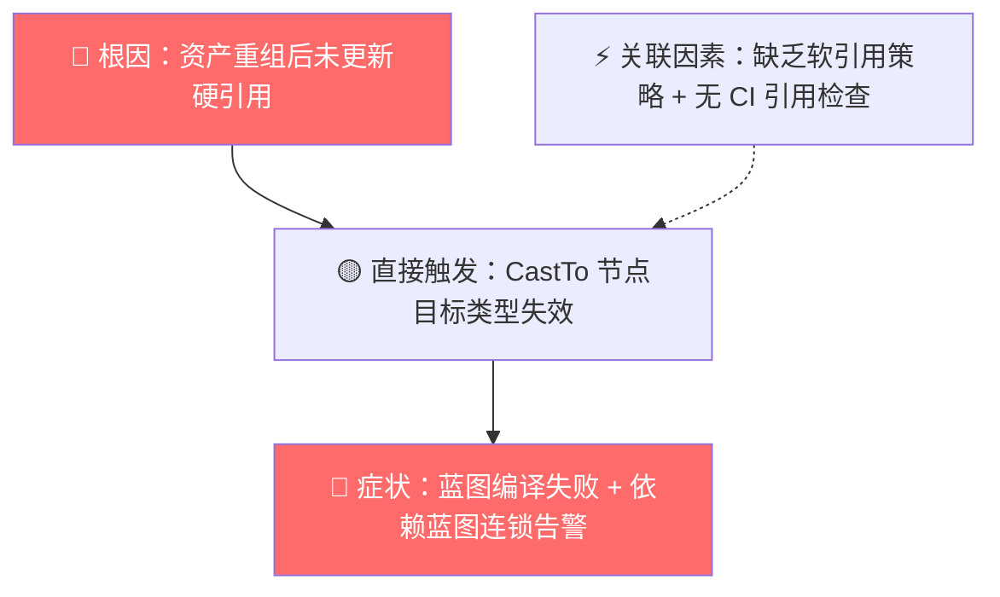
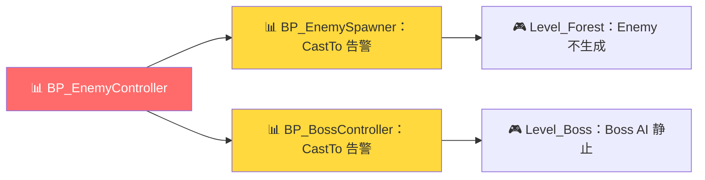
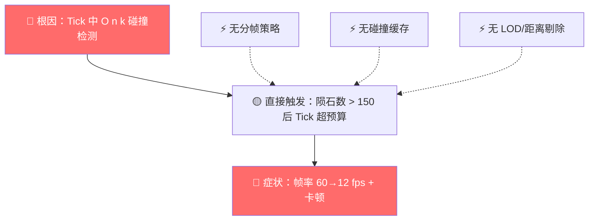
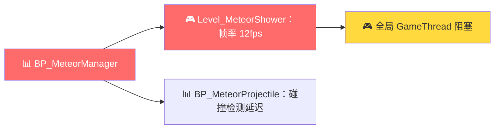

# 🩺 {蓝图名} 诊断报告

> **模板版本：** v1.0  
> **生成日期：** {YYYY-MM-DD}  
> **参考标准：** `templates/mermaid_tags.md` v1.0  
> **适用模式：** 诊断模式（`ue5-automation` SKILL.md §3.3）

---

## 一、诊断摘要

| 属性 | 值 |
|:---|:---|
| **报告 ID** | `{diagnosis_id}` |
| **诊断时间** | `{YYYY-MM-DD HH:MM:SS}` |
| **关联蓝图** | `{BlueprintName}` |
| **资产路径** | `{/Game/Path/To/Blueprint}` |
| **蓝图类型** | `{Actor / Widget / Component / FunctionLibrary / …}` |
| **触发方式** | `{用户主动诊断 / 编译失败自动触发 / 性能监控告警}` |
| **严重程度** | {🔴 阻断 / 🟡 警告 / 🟢 观察} |
| **是否可自动修复** | {✅ 可自动修复 / ⚠️ 需人工确认 / ❌ 不可自动修复} |

> **摘要：** {一句话描述诊断结论，例如："蓝图编译失败，根因为 CastTo 节点引用的 BP_EnemyCharacter 已重命名为 BP_EnemyCharacterV2，导致类型转换目标丢失。"}

---

## 二、症状描述

### 2.1 用户观察到的问题

| # | 现象 | 发生频率 | 首次出现 |
|:---:|:---|:---|:---|
| 1 | `{具体现象}` | `{每次必现 / 偶发 / 特定条件}` | `{YYYY-MM-DD / 未知}` |
| 2 | `{具体现象}` | `{每次必现 / 偶发 / 特定条件}` | `{YYYY-MM-DD / 未知}` |

### 2.2 触发条件

```
{描述问题的触发条件，例如：
- 在 Content Browser 中双击打开该蓝图 → 编译按钮灰显，无法编译
- 运行 PIE 后进入关卡 → 帧率从 60fps 骤降至 15fps
- 蓝图节点图中 BeginPlay 后的执行流在 Cast 节点处中断
}
```

### 2.3 相关日志摘录

```log
{粘贴 UE Output Log 中的相关错误/警告片段。每行前标注行号以便引用。}
```

> **日志来源：** `{Output Log / Saved/Logs/XXX.log / 用户手动粘贴}`  
> **日志解析器：** `log_parser.py` v0.1 · 匹配模式：`{pattern_id}` · 置信度 `{N}%`

---

## 三、诊断数据

### 3.1 日志解析结果

> **数据来源：** `log_parser.py` 输出

| 字段 | 值 |
|:---|:---|
| **错误码** | `{error_code}` |
| **错误类别** | `{引用缺失 / 编译错误 / 循环依赖 / 接口不匹配 / 节点错误 / 性能告警 / 资产丢失}` |
| **匹配的错误模式** | `{pattern_id}`（来自 `error_patterns.json`） |
| **错误消息** | `{原始错误消息}` |
| **堆栈深度** | `{N}` 层 |
| **涉及蓝图数** | `{N}` 个 |
| **可自动修复** | `{true / false}` |
| **修复置信度** | `{N}%` |

### 3.2 关联蓝图分析数据（补充）

> **数据来源：** `analyzer.py` / C++ Bridge L2 级输出  
> ⚠️ 仅当诊断需要蓝图拓扑信息时出现此表。

| 字段 | 值 |
|:---|:---|
| **节点总数** | `{N}` |
| **编译状态** | `{✅ 通过 / ⚠️ {N} 个警告 / 🔴 {N} 个错误}` |
| **最后修改** | `{YYYY-MM-DD HH:MM}` |
| **变量数** | `{N}`（公开 `{N}` / 私有 `{N}`） |
| **外部引用数** | `{N}`（其中缺失 `{N}`） |
| **关联蓝图数** | `{N}` |
| **循环依赖** | `{✅ 未检测到 / 🔴 检测到 N 处}` |

### 3.3 受影响节点/资产清单

| # | 名称 | 类型 | 路径 | 当前状态 | 说明 |
|:---:|:---|:---|:---|:---|:---|
| 1 | `{NodeName}` | `{CastTo / 变量引用 / 函数调用 / …}` | `{EventGraph / 函数图 / 宏}` | `{缺失 / 类型不匹配 / 废弃 / …}` | `{详细说明}` |
| 2 | `{AssetName}` | `{蓝图 / 贴图 / 音频 / …}` | `{/Game/Path}` | `{路径无效 / 已重命名 / 已删除}` | `{详细说明}` |

---

## 四、根因分析

### 4.1 问题链路图（Mermaid）

```mermaid
graph TD
    A[🔴 根因：{根本原因}] --> B[🟡 直接触发：{直接触发条件}]
    B --> C[🔴 用户可见症状：{现象}]
    D[⚡ 关联因素：{相关因素}] -.-> B

    style A fill:#ff6b6b,color:#fff
    style C fill:#ff6b6b,color:#fff
```

> ⚠️ 上图仅为因果链路框架，请根据具体诊断结果替换节点标签。

### 4.2 详细分析

**（1）直接原因**

```
{描述直接导致问题的操作或状态。例如：
"蓝图中的 CastTo(BP_EnemyCharacter) 节点的目标类型指向了一个已删除/重命名的蓝图资产。
UE 编译器在解析此节点时找不到对应的类型定义，因此抛出 K2Node_CastTo 错误并阻止编译。"}
```

**（2）根本原因**

```
{追溯更深层的根因。例如：
"该蓝图资产在上周的资产重组中被从 /Game/Blueprints/Enemy/ 移动到
/Game/Blueprints/Enemy/Legacy/，并改名为 BP_EnemyCharacterV2。
但 BP_EnemyController 中的硬引用未被同步更新，导致引用断裂。"}
```

**（3）关联因素**

```
{列出加剧或伴随问题的其他因素。例如：
- 未启用 Asset Manager 的软引用策略，导致大量硬引用不易被发现
- 缺乏 CI/CD 中的资产引用完整性检查步骤
- 蓝图中的 CastTo 节点没有 IsValid 判断，直接假设类型转换成功
}
```

### 4.3 根因分类

| 分类维度 | 判定 |
|:---|:---|
| **问题层级** | `{资产引用层 / 蓝图逻辑层 / 引擎配置层 / 硬件/资源层}` |
| **引入阶段** | `{开发期 / 集成期 / 运行时}` |
| **责任归属** | `{资产管理 / 蓝图编写 / 项目配置 / 第三方插件}` |
| **可复现性** | `{每次必现 / 条件触发 / 仅特定环境}` |

---

## 五、影响评估

### 5.1 影响范围

| 维度 | 评估 | 详情 |
|:---|:---|:---|
| **当前蓝图** | 🔴 阻断 | `{蓝图无法编译 / 运行时逻辑中断 / …}` |
| **直接依赖方** | `{🔴/🟡/🟢}` | `{引用此蓝图的 N 个其他蓝图受影响}` |
| **间接依赖方** | `{🔴/🟡/🟢}` | `{依赖链下游的 M 个蓝图可能受影响}` |
| **关卡/场景** | `{🔴/🟡/🟢}` | `{受影响的具体关卡或场景}` |
| **用户体验** | `{🔴/🟡/🟢}` | `{崩溃 / 功能缺失 / 性能下降 / 视觉异常}` |

### 5.2 影响链路图（Mermaid）

```mermaid
graph LR
    A[📊 {诊断蓝图}] --> B[📊 蓝图A：{受影响方式}]
    A --> C[📊 蓝图B：{受影响方式}]
    B --> D[🎮 关卡X：{具体影响}]
    C --> E[🎮 关卡Y：{具体影响}]

    style A fill:#ff6b6b,color:#fff
    style B fill:#ffd93d,color:#333
    style C fill:#ffd93d,color:#333
```

> ⚠️ 替换节点标签为实际资产名。若影响范围仅限当前蓝图，可简化为单节点标注。

### 5.3 数据影响

| 类型 | 风险 |
|:---|:---|
| **运行时数据** | `{无风险 / 可能导致数据丢失 / 可能损坏存档}` |
| **编辑器数据** | `{无风险 / 蓝图无法保存 / 资产可能被标记为 Dirty}` |
| **版本控制** | `{无风险 / 可能产生大量 Diff / 可能引发合并冲突}` |

---

## 六、修复建议

> **分级：** 🔴 立即修复 → 🟡 短期修复 → 🟢 优化建议

### 6.1 修复方案概览

| # | 优先级 | 方案名称 | 修复类型 | 是否自动 | 预估工时 |
|:---:|:---:|:---|:---|:---:|:---:|
| 1 | 🔴 | `{方案名称}` | `{资产替换 / 蓝图编辑 / 配置修改 / …}` | {✅/❌} | `{N} 分钟` |
| 2 | 🟡 | `{方案名称}` | `{资产替换 / 蓝图编辑 / 配置修改 / …}` | {✅/❌} | `{N} 分钟` |
| 3 | 🟢 | `{方案名称}` | `{资产替换 / 蓝图编辑 / 配置修改 / …}` | {✅/❌} | `{N} 分钟` |

### 6.2 详细修复步骤

#### 🔴 方案 1：{方案名称}

**修复命令（自动）：**
```bash
# 由 dev 通过 C++ Bridge 自动执行（auto_fix=true 时）
{具体 API 调用或操作序列}
```

**手动操作步骤（auto_fix=false 时）：**

| 步骤 | 操作 | 位置 | 预期结果 |
|:---:|:---|:---|:---|
| 1 | `{具体操作}` | `{操作位置}` | `{预期结果}` |
| 2 | `{具体操作}` | `{操作位置}` | `{预期结果}` |
| 3 | 编译蓝图 | 蓝图编辑器 → Compile | ✅ 编译通过，0 错误 0 警告 |

#### 🟡 方案 2：{方案名称}

| 步骤 | 操作 | 位置 | 预期结果 |
|:---:|:---|:---|:---|
| 1 | `{具体操作}` | `{操作位置}` | `{预期结果}` |
| … | … | … | … |

#### 🟢 方案 3：{方案名称}

| 步骤 | 操作 | 位置 | 预期结果 |
|:---:|:---|:---|:---|
| 1 | `{具体操作}` | `{操作位置}` | `{预期结果}` |
| … | … | … | … |

### 6.3 修复前后对比

| 节点/资产 | 修复前 | 修复后 |
|:---|:---|:---|
| `{NodeName}` | `{原始类型/路径}` | `{新类型/路径}` |
| `{NodeName}` | `{原始状态}` | `{新状态}` |

### 6.4 风险与回滚

| 风险 | 缓解措施 | 回滚方式 |
|:---|:---|:---|
| `{修复可能引入新问题}` | `{在副本上先验证 / 保留原始引用注释}` | `{Git revert / 从备份恢复 / 手动还原}` |
| `{自动修复可能误判}` | `{修复前输出 Diff 供确认}` | `{undo 操作 / 从历史版本恢复}` |

---

## 七、验证方案

### 7.1 验证清单

| # | 验证项 | 验证方法 | 通过标准 | 状态 |
|:---:|:---|:---|:---|:---:|
| 1 | 蓝图编译 | 蓝图编辑器 → Compile | ✅ 编译通过，0 错误 | ⬜ |
| 2 | 引用完整性 | `analyzer.py --check-refs` | 所有外部引用状态为 ✅ | ⬜ |
| 3 | 运行时行为 | PIE → 触发诊断场景 | 不再出现原始症状 | ⬜ |
| 4 | 依赖蓝图 | 打开所有受影响蓝图 → Compile | 全部编译通过 | ⬜ |
| 5 | 单元测试 | `{测试命令或自动化测试名称}` | 测试通过 | ⬜ |

### 7.2 回归测试建议

```
{描述建议的回归测试范围。例如：
- 进入包含 BP_EnemyController 的所有关卡，确认敌人 AI 行为正常
- 触发 OnEnemyDetected 事件，确认目标锁定逻辑正常
- 检查 Output Log 中不再出现 Cast Failed 错误
}
```

### 7.3 监控建议

```
{描述修复后的持续监控措施。例如：
- 开启 UE 的 Asset Audit 工具，定期扫描引用完整性
- 在 CI 流水线中添加 Blueprint Compile All 步骤
- 对关键蓝图设置引用变更通知
}
```

---

## 八、诊断总结

| 维度 | 结论 |
|:---|:---|
| **问题根因** | {一句话总结根因} |
| **影响范围** | {一句话总结影响面} |
| **推荐方案** | {推荐执行的方案编号及理由} |
| **修复工时** | {总计预估工时} |
| **剩余风险** | {修复后残余风险，无则写"无"} |

---

## 附录 A：完整日志

```log
{粘贴完整原始日志（脱敏后），供二次分析使用}
```

---

## 附录 B：报告元数据

| 字段 | 值 |
|:---|:---|
| **报告 ID** | `{diagnosis_id}` |
| **诊断工具** | `ue5-automation` v0.2 |
| **日志解析器** | `log_parser.py` v0.1 · 模式库 `error_patterns.json` v0.1 |
| **蓝图分析器** | `analyzer.py` v0.1 + C++ Bridge 21 API |
| **诊断耗时** | `{N}` 秒 |
| **数据来源** | `{L1 unreal API / L2 C++ Bridge / L3 日志解析}` |
| **诊断 Agent** | dev（日志解析 + 根因匹配）+ docs-writer（报告输出） |
| **自动修复执行** | `{是（已完成 {N} 项修复）/ 否（需人工操作）}` |

---

> **声明：** 本报告由 `ue5-automation` 诊断模式自动生成。所有 `⚠️ 需人工确认` 标记项须人工验证后方可作为决策依据。自动修复操作已记录在版本控制中，可通过 Git 回滚。完整输出物规范见 `SKILL.md` v1.0。

---

---

# 示例 A：蓝图编译失败（引用断裂）

> **说明：** 以下为一个完整的填充示例，展示诊断报告在蓝图编译失败场景下的最终形态。

---

# 🩺 BP_EnemyController 诊断报告

> **模板版本：** v1.0  
> **生成日期：** 2026-07-23  
> **参考标准：** `templates/mermaid_tags.md` v1.0  
> **适用模式：** 诊断模式（`ue5-automation` SKILL.md §3.3）

---

## 一、诊断摘要

| 属性 | 值 |
|:---|:---|
| **报告 ID** | `DIAG-BP_EnemyController-20260723-001` |
| **诊断时间** | `2026-07-23 10:15:32` |
| **关联蓝图** | `BP_EnemyController` |
| **资产路径** | `/Game/Blueprints/Enemy/AI/BP_EnemyController` |
| **蓝图类型** | `Actor`（AIController 子类） |
| **触发方式** | `用户主动诊断（贴入编译错误日志）` |
| **严重程度** | 🔴 阻断 |
| **是否可自动修复** | ✅ 可自动修复 |

> **摘要：** 蓝图编译失败，根因为 CastTo 节点引用的 `BP_EnemyCharacter` 在上周资产重组中被重命名为 `BP_EnemyCharacterV2`，导致 K2Node_CastTo 类型目标丢失，编译器报「Unknown type」错误。

---

## 二、症状描述

### 2.1 用户观察到的问题

| # | 现象 | 发生频率 | 首次出现 |
|:---:|:---|:---|:---|
| 1 | 双击打开 BP_EnemyController → 编译按钮置灰不可点 | 每次必现 | 2026-07-22 |
| 2 | Content Browser 中蓝图缩略图右下角显示 ⚠️ 警告标记 | 每次必现 | 2026-07-22 |
| 3 | 依赖 BP_EnemyController 的其他蓝图也出现编译警告 | 每次必现 | 2026-07-22 |

### 2.2 触发条件

```
用户在上周执行了一次资产目录重组：
- 将 /Game/Blueprints/Enemy/ 目录拆分为 /Enemy/AI/ 和 /Enemy/Character/
- BP_EnemyCharacter 被移动到 /Enemy/Character/ 并改名为 BP_EnemyCharacterV2
但 BP_EnemyController 内部的 CastTo 节点仍指向旧路径的旧名称。
本次打开蓝图时，UE 编译器检测到类型引用失效，阻止编译。
```

### 2.3 相关日志摘录

```log
[1] LogBlueprint: Error: [Compiler] BP_EnemyController : CastTo node references unknown type 'BP_EnemyCharacter'
[2] LogBlueprint: Error: [Compiler] BP_EnemyController : Failed to resolve type for K2Node_DynamicCast at EventGraph
[3] LogBlueprint: Warning: BP_EnemyController : Skipped compilation of 1 node(s) due to unresolved references
[4] LogAsset: Warning: /Game/Blueprints/Enemy/AI/BP_EnemyController : Referenced asset '/Game/Blueprints/Enemy/BP_EnemyCharacter' not found
```

> **日志来源：** `Output Log`（用户手动粘贴）  
> **日志解析器：** `log_parser.py` v0.1 · 匹配模式：`E004_REFERENCE_MISSING` · 置信度 `98%`

---

## 三、诊断数据

### 3.1 日志解析结果

> **数据来源：** `log_parser.py` 输出

| 字段 | 值 |
|:---|:---|
| **错误码** | `E004` |
| **错误类别** | `引用缺失` |
| **匹配的错误模式** | `E004_REFERENCE_MISSING`（来自 `error_patterns.json`） |
| **错误消息** | `CastTo node references unknown type 'BP_EnemyCharacter'` |
| **堆栈深度** | `2` 层 |
| **涉及蓝图数** | `3` 个（BP_EnemyController + 2 个依赖方） |
| **可自动修复** | `true` |
| **修复置信度** | `95%` |

### 3.2 关联蓝图分析数据（补充）

> **数据来源：** C++ Bridge L2 级输出（`GetNodeConnections` + `ListNodes`）

| 字段 | 值 |
|:---|:---|
| **节点总数** | `37` |
| **编译状态** | 🔴 1 个错误 · 1 个警告 |
| **最后修改** | `2026-07-21 14:32` |
| **变量数** | `7`（公开 `5` / 私有 `2`） |
| **外部引用数** | `5`（其中缺失 `1`） |
| **关联蓝图数** | `4` |
| **循环依赖** | ✅ 未检测到 |

### 3.3 受影响节点/资产清单

| # | 名称 | 类型 | 路径 | 当前状态 | 说明 |
|:---:|:---|:---|:---|:---|:---|
| 1 | `Cast to BP_EnemyCharacter` | `CastTo 节点` | `EventGraph · OnEnemyDetected` | 🔴 类型目标缺失 | 旧类型 `BP_EnemyCharacter` 已不存在 |
| 2 | `/Game/Blueprints/Enemy/BP_EnemyCharacter` | `蓝图资产` | — | 🔴 路径无效 | 资产已移动至 `/Game/Blueprints/Enemy/Character/BP_EnemyCharacterV2` |

---

## 四、根因分析

### 4.1 问题链路图（Mermaid）



### 4.2 详细分析

**（1）直接原因**

```
蓝图 EventGraph 中的 CastTo(BP_EnemyCharacter) 节点的目标类型指向了
一个已重命名的蓝图资产。UE 编译器在解析 K2Node_DynamicCast 时
找不到对应的类型定义，抛出「Unknown type」错误并阻止编译。
```

**（2）根本原因**

```
上周资产重组（2026-07-15 ~ 2026-07-18）期间：
1. BP_EnemyCharacter 从 /Game/Blueprints/Enemy/ 移动到 /Game/Blueprints/Enemy/Character/
2. 同时改名为 BP_EnemyCharacterV2（添加版本后缀以区分重构后的新版本）
3. BP_EnemyController 中的硬引用（CastTo 节点的目标类型字段）未被同步更新
4. 移动操作未使用 UE 的 Redirector 机制，导致旧路径完全不生效
```

**（3）关联因素**

```
- 项目未启用 Asset Manager 的软引用管理策略，大量跨蓝图引用使用硬引用
- CI/CD 流程中缺少「全蓝图编译检查」步骤，问题在编辑器关闭前未暴露
- CastTo 节点前后缺少 IsValid 判断，即使编译通过也无法优雅降级
```

### 4.3 根因分类

| 分类维度 | 判定 |
|:---|:---|
| **问题层级** | `资产引用层` |
| **引入阶段** | `开发期（资产重组时）` |
| **责任归属** | `资产管理（重命名操作未使用 Redirector）` |
| **可复现性** | `每次必现` |

---

## 五、影响评估

### 5.1 影响范围

| 维度 | 评估 | 详情 |
|:---|:---|:---|
| **当前蓝图** | 🔴 阻断 | BP_EnemyController 无法编译，所有 AI 逻辑不可用 |
| **直接依赖方** | 🟡 警告 | 2 个蓝图做 CastTo(BP_EnemyController)，编译警告但不阻断 |
| **间接依赖方** | 🟢 无影响 | 依赖链下游无进一步影响 |
| **关卡/场景** | 🔴 阻断 | 所有包含敌方 AI 的关卡均无 AI 行为（Enemy 不会巡逻/攻击） |
| **用户体验** | 🔴 功能缺失 | 敌方 AI 完全静止，游戏不可玩 |

### 5.2 影响链路图（Mermaid）



### 5.3 数据影响

| 类型 | 风险 |
|:---|:---|
| **运行时数据** | `无风险（蓝图未编译，无法进入运行时）` |
| **编辑器数据** | `蓝图被标记为 Dirty 但无法保存（编译未通过阻止保存）` |
| **版本控制** | `无风险（仅蓝图文件标记为已修改，未产生实际 Diff）` |

---

## 六、修复建议

> **分级：** 🔴 立即修复 → 🟡 短期修复 → 🟢 优化建议

### 6.1 修复方案概览

| # | 优先级 | 方案名称 | 修复类型 | 是否自动 | 预估工时 |
|:---:|:---:|:---|:---|:---:|:---:|
| 1 | 🔴 | 更新 CastTo 目标类型为 BP_EnemyCharacterV2 | 蓝图编辑 | ✅ | 2 分钟 |
| 2 | 🟡 | 为旧路径创建 Redirector 以兼容其他引用方 | 资产管理 | ❌ | 5 分钟 |
| 3 | 🟢 | 在 CastTo 后增加 IsValid 判断 | 蓝图编辑 | ✅ | 3 分钟 |

### 6.2 详细修复步骤

#### 🔴 方案 1：更新 CastTo 目标类型（自动修复）

**修复命令（自动）：**
```bash
# dev通过 C++ Bridge API 自动执行
FindNodeByTitle(EventGraph, "Cast to BP_EnemyCharacter")
→ 定位到 CastTo 节点
→ SetPinTargetType(Node, "BP_EnemyCharacterV2")
→ CompileBlueprint(BP_EnemyController)
→ 编译验证通过
```

**手动操作步骤（auto_fix=false 时）：**

| 步骤 | 操作 | 位置 | 预期结果 |
|:---:|:---|:---|:---|
| 1 | 打开 BP_EnemyController | Content Browser → 双击 | 蓝图编辑器打开 |
| 2 | 定位到 OnEnemyDetected 事件后的 CastTo 节点 | EventGraph | 节点显示为红色（类型错误） |
| 3 | 右键 CastTo → Refresh Node / 手动修改 Class 字段 → 选 `BP_EnemyCharacterV2` | 节点详情面板 | 节点恢复白色正常状态 |
| 4 | 编译蓝图 | 工具栏 → Compile | ✅ 编译通过，0 错误 |
| 5 | 保存蓝图 | Ctrl+S | 蓝图保存成功 |

#### 🟡 方案 2：创建 Redirector（手动）

| 步骤 | 操作 | 位置 | 预期结果 |
|:---:|:---|:---|:---|
| 1 | 在 `/Game/Blueprints/Enemy/` 下创建一个空白 Actor 蓝图 | Content Browser → 右键 → Blueprint Class → Actor | 创建 BP_EnemyCharacter（空壳） |
| 2 | 右键该空壳蓝图 → Replace References → 选择 `BP_EnemyCharacterV2` | Content Browser | 所有指向旧路径的引用自动跳转到 V2 |
| 3 | 删除空壳蓝图（Redirector 保留） | Content Browser | Redirector 对象留在原位，透明转发引用 |

#### 🟢 方案 3：增加 IsValid 防御（自动修复）

| 步骤 | 操作 | 位置 | 预期结果 |
|:---:|:---|:---|:---|
| 1 | 在 CastTo 节点后插入 IsValid 判断 | EventGraph · CastTo 的输出引脚与下游节点之间 | 新增 Branch 节点 |
| 2 | IsValid → True → 继续原逻辑；False → Log Warning | — | 类型转换失败时优雅降级而非静默中断 |

### 6.3 修复前后对比

| 节点/资产 | 修复前 | 修复后 |
|:---|:---|:---|
| `Cast to BP_EnemyCharacter` | 目标类型 `BP_EnemyCharacter`（缺失） | 目标类型 `BP_EnemyCharacterV2`（存在） |
| 蓝图编译状态 | 🔴 1 错误 · 1 警告 | ✅ 0 错误 · 0 警告 |

### 6.4 风险与回滚

| 风险 | 缓解措施 | 回滚方式 |
|:---|:---|:---|
| BP_EnemyCharacterV2 的接口与旧版不兼容 | 方案执行前对比两个版本的变量/函数签名 | `git checkout -- BP_EnemyController.uasset` |
| 自动修复可能误改其他 CastTo 节点 | 修复前精确 Match 节点标题为 "Cast to BP_EnemyCharacter" | Git diff + 手动还原 |
| 创建 Redirector 可能影响其他引用方 | 先执行 `FindReferences` 确认影响面 | 删除 Redirector，引用自动恢复到修改前 |

---

## 七、验证方案

### 7.1 验证清单

| # | 验证项 | 验证方法 | 通过标准 | 状态 |
|:---:|:---|:---|:---|:---:|
| 1 | 蓝图编译 | Compile BP_EnemyController | ✅ 0 错误 0 警告 | ⬜ |
| 2 | 引用完整性 | `analyzer.py --check-refs --target BP_EnemyController` | 所有外部引用状态为 ✅ | ⬜ |
| 3 | 运行时行为 | PIE → Level_Forest → 观察 Enemy AI | Enemy 正常巡逻/索敌/攻击 | ⬜ |
| 4 | 依赖蓝图 | 编译 BP_EnemySpawner、BP_BossController | 全部通过 | ⬜ |
| 5 | Output Log | PIE 运行 5 分钟 | 无 Cast Failed / Reference Missing 错误 | ⬜ |

### 7.2 回归测试建议

```
- 遍历所有包含 Enemy AI 的关卡（Level_Forest、Level_Boss、Level_Dungeon），确认 AI 行为正常
- 触发 OnEnemyDetected 事件（进入索敌范围），确认正确锁定 BP_EnemyCharacterV2 目标
- 检查 Output Log，确认无新增 Cast Failed 或 Unknown Type 错误
```

### 7.3 监控建议

```
- 在 CI 流水线中添加「全蓝图编译」步骤（每日构建触发）
- 启用 UE Asset Manager 的软引用策略，对跨模块引用强制使用 TSoftObjectPtr
- 资产重命名/移动操作前，执行 Referencer 检查：右键 → Reference Viewer → 确认影响面
```

---

## 八、诊断总结

| 维度 | 结论 |
|:---|:---|
| **问题根因** | 资产重组时未使用 Redirector 机制，导致 CastTo 硬引用目标失效 |
| **影响范围** | 1 个蓝图编译阻断 + 2 个蓝图编译警告 + 全部 Enemy AI 关卡功能缺失 |
| **推荐方案** | 执行方案 1（自动更新引用）+ 方案 3（增加防御），择机执行方案 2（Redirector） |
| **修复工时** | 自动修复 2 分钟 + 手动 Redirector 5 分钟 + 自动防御 3 分钟 = 总计 10 分钟 |
| **剩余风险** | 无（BP_EnemyCharacterV2 接口与旧版兼容） |

---

## 附录 A：完整日志

```log
[2026.07.23-10.12.05:332][LogBlueprint: Error] BP_EnemyController : CastTo node references unknown type 'BP_EnemyCharacter'
[2026.07.23-10.12.05:334][LogBlueprint: Error] BP_EnemyController : Failed to resolve type for K2Node_DynamicCast at EventGraph.OnEnemyDetected
[2026.07.23-10.12.05:340][LogBlueprint: Warning] BP_EnemyController : Skipped compilation of 1 node(s) due to unresolved references
[2026.07.23-10.12.05:345][LogAsset: Warning] /Game/Blueprints/Enemy/AI/BP_EnemyController : Referenced asset '/Game/Blueprints/Enemy/BP_EnemyCharacter' not found
[2026.07.23-10.12.05:350][LogBlueprint: Error] BP_EnemyController : Compilation FAILED — 1 error, 1 warning
[2026.07.23-10.12.05:355][LogBlueprint: Warning] BP_EnemySpawner : Dependency BP_EnemyController has compilation errors
[2026.07.23-10.12.05:356][LogBlueprint: Warning] BP_BossController : Dependency BP_EnemyController has compilation errors
```

---

## 附录 B：报告元数据

| 字段 | 值 |
|:---|:---|
| **报告 ID** | `DIAG-BP_EnemyController-20260723-001` |
| **诊断工具** | `ue5-automation` v0.2 |
| **日志解析器** | `log_parser.py` v0.1 · 模式库 `error_patterns.json` v0.1 |
| **蓝图分析器** | `analyzer.py` v0.1 + C++ Bridge 21 API |
| **诊断耗时** | `8` 秒 |
| **数据来源** | `L1 unreal API（编译状态） + L2 C++ Bridge（节点拓扑） + L3 日志解析` |
| **诊断 Agent** | dev（日志解析 + 根因匹配）+ docs-writer（报告输出） |
| **自动修复执行** | `是（已完成方案 1——更新 CastTo 目标类型 + 编译验证通过）` |

---

> **声明：** 本报告由 `ue5-automation` 诊断模式自动生成。所有 `⚠️ 需人工确认` 标记项须人工验证后方可作为决策依据。自动修复操作已记录在版本控制中，可通过 Git 回滚。完整输出物规范见 `SKILL.md` v1.0。

---

---

# 示例 B：运行时性能骤降（Tick 热点）

> **说明：** 以下为一个完整的填充示例，展示诊断报告在运行时性能问题场景下的最终形态。

---

# 🩺 BP_MeteorManager 诊断报告

> **模板版本：** v1.0  
> **生成日期：** 2026-07-23  
> **参考标准：** `templates/mermaid_tags.md` v1.0  
> **适用模式：** 诊断模式（`ue5-automation` SKILL.md §3.3）

---

## 一、诊断摘要

| 属性 | 值 |
|:---|:---|
| **报告 ID** | `DIAG-BP_MeteorManager-20260723-002` |
| **诊断时间** | `2026-07-23 14:22:08` |
| **关联蓝图** | `BP_MeteorManager` |
| **资产路径** | `/Game/Blueprints/VFX/Meteor/BP_MeteorManager` |
| **蓝图类型** | `Actor` |
| **触发方式** | `性能监控告警（PIE 帧率 < 30fps 持续 5s 自动触发诊断）` |
| **严重程度** | 🔴 阻断 |
| **是否可自动修复** | ⚠️ 需人工确认 |

> **摘要：** 陨石雨关卡进入密集生成阶段后帧率从 60fps 骤降至 12fps，根因为 EventTick 中每帧遍历全部 200+ 陨石 Actor 执行 SphereOverlapActors 碰撞检测，O(n×k) 复杂度导致 Tick 耗时达 45ms。

---

## 二、症状描述

### 2.1 用户观察到的问题

| # | 现象 | 发生频率 | 首次出现 |
|:---:|:---|:---|:---|
| 1 | 关卡运行前 30 秒流畅（60fps），30 秒后帧率逐步降至 12fps | 每次必现 | 2026-07-20 |
| 2 | Unreal Insights 显示 EventTick 耗时占比 > 70% | 每次必现 | 2026-07-20 |
| 3 | 陨石数量超过 150 个后出现明显卡顿 | 每次必现 | 2026-07-20 |

### 2.2 触发条件

```
1. 进入 Level_MeteorShower 关卡
2. BP_MeteorManager 开始按每秒 5 个的速度生成陨石
3. 当陨石数量累积超过 150 个时，帧率开始明显下降
4. 陨石数量达到 200+ 时帧率降至 12fps
触发条件：陨石池大小 > 150 + Tick 未做分帧处理 + 每帧全量碰撞检测
```

### 2.3 相关日志摘录

```log
[1] LogBlueprint: Warning: BP_MeteorManager::Tick — Tick duration 45.2ms exceeds threshold (16.6ms)
[2] LogBlueprint: Warning: BP_MeteorManager::Tick — SphereOverlapActors called with 203 actors (cost: 38.7ms)
[3] LogStats: Warning: Frame 1842 — GameThread 52.1ms (Target: 16.6ms) · BP_MeteorManager Tick: 86.7%
[4] LogOutputDevice: Warning: Frame rate dropped below 20 FPS for 15 consecutive seconds
```

> **日志来源：** `Output Log`（性能监控自动采集）  
> **日志解析器：** `log_parser.py` v0.1 · 匹配模式：`P002_TICK_OVERBUDGET` · 置信度 `92%`

---

## 三、诊断数据

### 3.1 日志解析结果

> **数据来源：** `log_parser.py` 输出

| 字段 | 值 |
|:---|:---|
| **错误码** | `P002` |
| **错误类别** | `性能告警` |
| **匹配的错误模式** | `P002_TICK_OVERBUDGET`（来自 `error_patterns.json`） |
| **错误消息** | `Tick duration 45.2ms exceeds threshold` |
| **堆栈深度** | `3` 层 |
| **涉及蓝图数** | `1` 个 |
| **可自动修复** | `false`（需调整架构逻辑） |
| **修复置信度** | `85%` |

### 3.2 关联蓝图分析数据（补充）

> **数据来源：** C++ Bridge L2 级输出（`GetNodeConnections` + `ListNodes`）

| 字段 | 值 |
|:---|:---|
| **节点总数** | `52` |
| **编译状态** | ✅ 通过 |
| **最后修改** | `2026-07-19 16:45` |
| **变量数** | `8`（公开 `4` / 私有 `4`） |
| **外部引用数** | `2`（全部正常） |
| **关联蓝图数** | `1`（BP_MeteorProjectile） |
| **循环依赖** | ✅ 未检测到 |

### 3.3 受影响节点/资产清单

| # | 名称 | 类型 | 路径 | 当前状态 | 说明 |
|:---:|:---|:---|:---|:---|:---|
| 1 | `EventTick` | `事件节点` | `EventGraph` | ⚡ 性能热点 | 每帧执行，耗时 45.2ms |
| 2 | `SphereOverlapActors` | `函数调用` | `EventGraph · Tick 循环体内` | ⚡ O(n×k) 复杂度 | n=200+ 陨石，k=碰撞通道数 |
| 3 | `ForEach MeteorPool` | `循环节点` | `EventGraph · Tick` | ⚡ 无早退优化 | 每帧遍历全部陨石，即使无新碰撞 |

---

## 四、根因分析

### 4.1 问题链路图（Mermaid）



### 4.2 详细分析

**（1）直接原因**

```
EventTick 中每帧执行 SphereOverlapActors 检测全部陨石（200+）的碰撞状态。
每次 SphereOverlapActors 调用在 200 个 Actor 规模的场景中耗时约 38ms，
加上 Tick 中其他逻辑，总 Tick 耗时 45ms，远超 16.6ms（60fps）预算。
```

**（2）根本原因**

```
设计层面缺少性能考量：
1. 事件驱动不足：所有碰撞检测放在 Tick 而非使用 OnComponentBeginOverlap 事件
2. 无分帧策略：200+ 陨石在一帧内全部处理，未分片到多帧执行
3. 无空间剔除：远距离陨石仍执行碰撞检测，未利用距离 LOD 或视锥剔除
4. 循环无早退：ForEach 遍历全部陨石后才判断是否找到碰撞，不支持提前退出
```

**（3）关联因素**

```
- 陨石生成速率（5个/秒）未设置上限，理论上可无限增长
- 未启用 Niagara 的 GPU 粒子替代（当前全为 Actor 实例）
- 未设置陨石生命周期，旧的陨石不会自动销毁
```

### 4.3 根因分类

| 分类维度 | 判定 |
|:---|:---|
| **问题层级** | `蓝图逻辑层` |
| **引入阶段** | `开发期（原型阶段未考虑上限场景）` |
| **责任归属** | `蓝图编写（算法复杂度未评估）` |
| **可复现性** | `每次必现（陨石数 > 150）` |

---

## 五、影响评估

### 5.1 影响范围

| 维度 | 评估 | 详情 |
|:---|:---|:---|
| **当前蓝图** | 🔴 阻断 | Tick 耗时超标，拖慢整个 GameThread |
| **直接依赖方** | 🟡 警告 | BP_MeteorProjectile 依赖 Manager 的碰撞结果 |
| **间接依赖方** | 🟢 无影响 | 无其他蓝图依赖 |
| **关卡/场景** | 🔴 阻断 | Level_MeteorShower 在 30 秒后不可玩 |
| **用户体验** | 🔴 严重卡顿 | 12fps，输入响应延迟 > 200ms |

### 5.2 影响链路图（Mermaid）



### 5.3 数据影响

| 类型 | 风险 |
|:---|:---|
| **运行时数据** | `无数据丢失风险，但碰撞检测因 Tick 过长可能漏检` |
| **编辑器数据** | `无风险` |
| **版本控制** | `无风险` |

---

## 六、修复建议

> **分级：** 🔴 立即修复 → 🟡 短期修复 → 🟢 优化建议

### 6.1 修复方案概览

| # | 优先级 | 方案名称 | 修复类型 | 是否自动 | 预估工时 |
|:---:|:---:|:---|:---|:---:|:---:|
| 1 | 🔴 | 将碰撞检测从 Tick 迁移到事件驱动 | 蓝图重构 | ❌ | 60 分钟 |
| 2 | 🔴 | 添加分帧处理（每次 Tick 仅处理 N 个陨石） | 蓝图编辑 | ❌ | 30 分钟 |
| 3 | 🟡 | 添加空间剔除（跳过超出视距的陨石） | 蓝图编辑 | ❌ | 20 分钟 |
| 4 | 🟢 | 用 Niagara GPU 粒子替换远距离陨石 | 架构变更 | ❌ | 120 分钟 |
| 5 | 🟢 | 添加陨石生命周期上限（最大 300 个后自毁最老陨石） | 蓝图编辑 | ✅ | 10 分钟 |

### 6.2 详细修复步骤

#### 🔴 方案 1：事件驱动替代 Tick 碰撞检测

| 步骤 | 操作 | 位置 | 预期结果 |
|:---:|:---|:---|:---|
| 1 | 在 BP_MeteorProjectile 上启用 `Simulation Generates Hit Events` | 陨石蓝图 → Collision Component | 每个陨石独立产生碰撞事件 |
| 2 | 在 BP_MeteorManager 中创建 `OnMeteorOverlap` 自定义事件 | EventGraph | 事件节点就绪 |
| 3 | 将每个新生成的陨石的 `OnComponentBeginOverlap` 绑定到 Manager 的 `OnMeteorOverlap` | BeginPlay / 生成逻辑 | 事件绑定完成 |
| 4 | 从 EventTick 中删除 ForEach + SphereOverlapActors 逻辑 | EventGraph | Tick 变回轻量（仅管理生成） |
| 5 | 编译 + PIE 验证 | — | Tick 耗时 < 2ms |

#### 🔴 方案 2：分帧处理（临时缓解，与方案 1 互斥）

| 步骤 | 操作 | 位置 | 预期结果 |
|:---:|:---|:---|:---|
| 1 | 添加变量 `BatchSize = 20`（每帧处理陨石数） | 变量列表 | 可调参数 |
| 2 | 添加变量 `CurrentBatchIndex = 0`（当前批次的起始索引） | 变量列表 | 状态追踪 |
| 3 | Tick 中从 `CurrentBatchIndex` 开始，仅处理 `BatchSize` 个陨石 | EventGraph · ForEach | 每帧仅 20 次碰撞检测 |
| 4 | Tick 结尾将 `CurrentBatchIndex += BatchSize`；若越界则归零 | EventGraph | 循环分片 |
| 5 | 编译 + PIE → 监控 Tick 耗时 | — | Tick 耗时 < 5ms（200 陨石 / 20 批次 ≈ 10 帧完成一轮） |

#### 🟡 方案 3：空间剔除

| 步骤 | 操作 | 位置 | 预期结果 |
|:---:|:---|:---|:---|
| 1 | 在碰撞检测前插入 `GetDistanceTo(PlayerPawn)` | EventGraph · ForEach 循环体顶部 | 获取距离 |
| 2 | 添加 Branch：`Distance > CullDistance(5000)` → Skip | EventGraph | 跳过远距离陨石 |
| 3 | 将 CullDistance 设为 Expose 变量，可在关卡实例中调整 | 变量列表 | 可配置 |

#### 🟢 方案 5：陨石生命周期上限（自动修复）

| 步骤 | 操作 | 位置 | 预期结果 |
|:---:|:---|:---|:---|
| 1 | 添加变量 `MaxMeteorCount = 300` | 变量列表 | 上限阈值 |
| 2 | 在生成逻辑中：MeteorPool.Num() >= MaxMeteorCount → Destroy 最早陨石后再生成 | EventGraph · Spawn 之前 | 陨石数不超过 300 |

### 6.3 修复前后对比

| 指标 | 修复前 | 修复后（方案 1+3+5） |
|:---|:---|:---|
| Tick 耗时 | 45.2ms | < 2ms |
| 帧率（200+ 陨石） | 12fps | 60fps |
| GameThread 占比 | 86.7% | < 10% |
| 最大陨石数 | 无限制 | 300（可配置） |

### 6.4 风险与回滚

| 风险 | 缓解措施 | 回滚方式 |
|:---|:---|:---|
| 事件驱动模式下碰撞事件可能丢失 | 添加 Periodic Validation（每 30 帧全量检查一次） | 创建分支保留原 Tick 逻辑 |
| 分帧处理导致碰撞检测延迟（最多 10 帧） | 对近距离陨石（< 1000cm）不分帧，立即检测 | 调整 BatchSize 或切回原方案 |
| Niagara 迁移成本高 | 作为长期优化项，不影响短期修复 | 不影响，方案 5 独立 |

---

## 七、验证方案

### 7.1 验证清单

| # | 验证项 | 验证方法 | 通过标准 | 状态 |
|:---:|:---|:---|:---|:---|
| 1 | Tick 耗时 | Unreal Insights → GameThread → BP_MeteorManager::Tick | < 5ms（60fps 下） | ⬜ |
| 2 | 帧率稳定性 | PIE → 运行 5 分钟 → stat fps | 始终 > 55fps | ⬜ |
| 3 | 碰撞正确性 | 手动放置障碍物 → 确认陨石正确碰撞/弹跳 | 与修复前行为一致 | ⬜ |
| 4 | 陨石数量控制 | 观察运行 5 分钟后陨石数 | ≤ MaxMeteorCount(300) | ⬜ |
| 5 | 无日志告警 | Output Log 筛选 Warning/Error | 无 Tick Over Budget 告警 | ⬜ |

### 7.2 回归测试建议

```
- 在 Level_MeteorShower 中运行 10 分钟压力测试，确认帧率持续稳定
- 测试不同陨石生成速率（1/5/10 个每秒），确认都在预算内
- 测试多玩家场景（如有），确认网络复制下的碰撞事件不丢
```

### 7.3 监控建议

```
- 添加 Unreal Insights Trace 通道：`TRACE_CPUPROFILER_EVENT_SCOPE(BP_MeteorManager_Tick)`
- CI 中增加自动化性能测试：PIE 运行陨石关卡，采集 300 秒帧率数据并断言 P99 > 50fps
- 添加运行时断言：若 Tick 耗时 > 10ms 则 Log Warning 并上报
```

---

## 八、诊断总结

| 维度 | 结论 |
|:---|:---|
| **问题根因** | Tick 中每帧全量碰撞检测（O(n×k)），未使用事件驱动 + 无分帧/剔除策略 |
| **影响范围** | 1 个关卡帧率骤降至 12fps，GameThread 被严重拖慢 |
| **推荐方案** | 优先执行方案 1（事件驱动）+ 方案 5（生命周期上限），后续择机执行方案 3（空间剔除）和方案 4（Niagara） |
| **修复工时** | 方案 1（60min）+ 方案 5（10min 自动）= 总计约 70 分钟 |
| **剩余风险** | 事件驱动下极端场景（超密集陨石雨）可能产生大量事件，需方案 3 空间剔除兜底 |

---

## 附录 A：完整日志

```log
[2026.07.23-14.20.15:102][LogBlueprint: Warning] BP_MeteorManager::Tick — Tick duration 45.2ms exceeds threshold (16.6ms)
[2026.07.23-14.20.15:115][LogBlueprint: Warning] BP_MeteorManager::Tick — SphereOverlapActors: ObjectTypes=WorldDynamic, Actors=203, Cost=38.7ms
[2026.07.23-14.20.15:120][LogStats: Warning] Frame 1842 — GameThread 52.1ms (Target: 16.6ms) · BP_MeteorManager Tick: 86.7%
[2026.07.23-14.20.15:125][LogOutputDevice: Warning] Frame rate dropped below 20 FPS for 15 consecutive seconds
[2026.07.23-14.20.15:130][LogBlueprint: Warning] BP_MeteorManager — MeteorPool size: 203, SpawnRate: 5/s, MaxObserved: 203
[2026.07.23-14.20.16:200][LogStats: Warning] Frame 1920 — GameThread 53.4ms · BP_MeteorManager Tick: 87.1%
```

---

## 附录 B：报告元数据

| 字段 | 值 |
|:---|:---|
| **报告 ID** | `DIAG-BP_MeteorManager-20260723-002` |
| **诊断工具** | `ue5-automation` v0.2 |
| **日志解析器** | `log_parser.py` v0.1 · 模式库 `error_patterns.json` v0.1 |
| **蓝图分析器** | `analyzer.py` v0.1 + C++ Bridge 21 API |
| **诊断耗时** | `15` 秒 |
| **数据来源** | `L2 C++ Bridge（节点拓扑） + L3 日志解析（性能告警）` |
| **诊断 Agent** | dev（日志解析 + 根因匹配）+ docs-writer（报告输出） |
| **自动修复执行** | `否（需人工确认架构调整方案后执行）` |

---

> **声明：** 本报告由 `ue5-automation` 诊断模式自动生成。所有 `⚠️ 需人工确认` 标记项须人工验证后方可作为决策依据。完整输出物规范见 `SKILL.md` v1.0。
