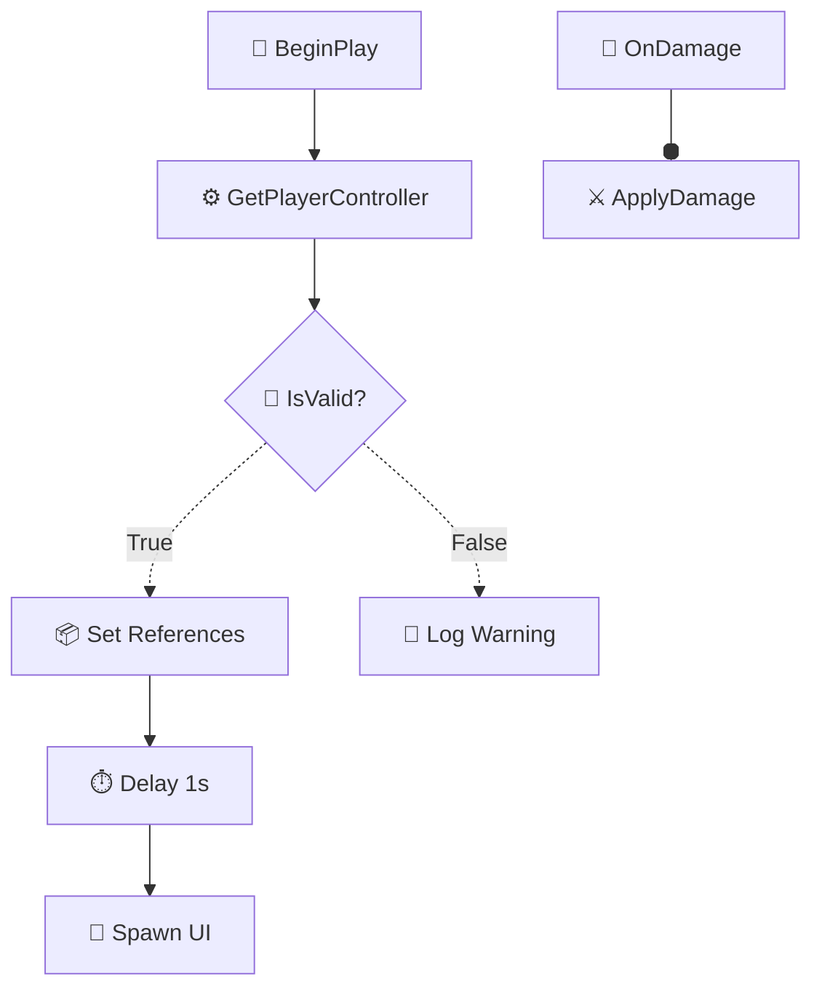
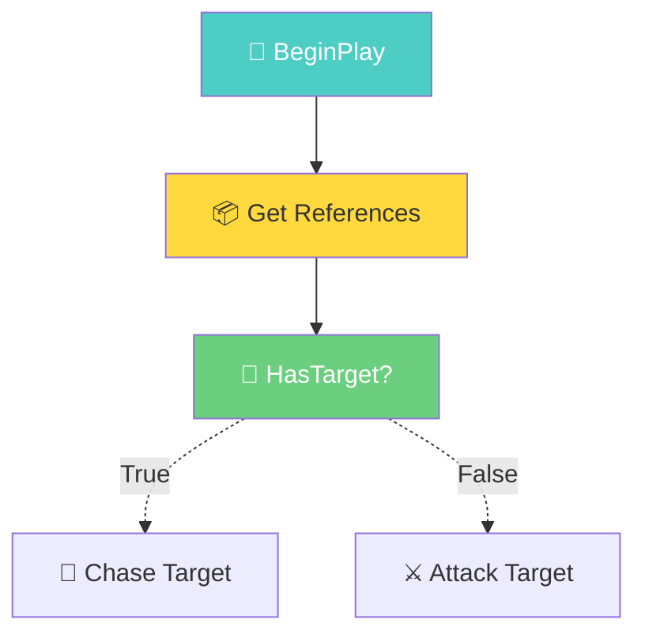
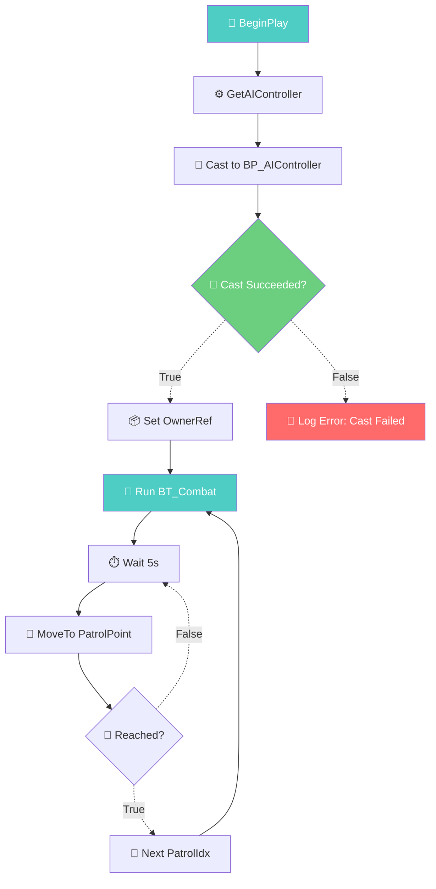

# UE5 蓝图流程图 — Mermaid emoji+中文标注标准

> **版本：** v1.0  
> **适用范围：** UE5.1 自动化工具`ue5-automation`技能集的所有报告模板  
> **制定日期：** 2026-07-22  
> **制定 Agent：** docs-writer（第2轮立项会议）

---

## 一、概述

本标准定义了 UE5 蓝图在 Mermaid 流程图中的**节点标签、连线语义、颜色约定**三套规范。所有报告模板（分析报告、创建方案、诊断报告、架构报告）中的流程图均须遵守此标准，确保跨文档一致、人机可读。

### 设计原则

1. **一节点一emoji**：每个节点类型唯一映射到一个 emoji，不混用
2. **中文优先**：节点描述使用中文，emoji 辅助视觉区分
3. **可降级**：emoji 渲染失败时，中文描述仍然可用
4. **可扩展**：预留 `❓` 标签处理未识别节点，可通过版本迭代补充

---

## 二、节点标签表（24 个标签）

### 2.1 完整标签映射

| 序号 | emoji | 标签含义 | 适用节点 | 示例 |
|:---:|:---|:---|:---|:---|
| 1 | 🚀 | 入口事件 | Event BeginPlay, Event Tick, Event ActorBeginOverlap, Event EndPlay | `🚀 BeginPlay` |
| 2 | 🔔 | 自定义/输入事件 | Custom Event, InputAction, EnhancedInput Action | `🔔 OnPlayerJump` |
| 3 | ⚙️ | 函数调用 | Call Function, 纯函数（Pure）, K2Node_CallFunction | `⚙️ GetPlayerController` |
| 4 | 🔀 | 条件分支 | Branch, Switch, Select, Compare Int/Float | `🔀 IsAlive?` |
| 5 | 🔄 | 循环/迭代 | ForLoop, ForEachLoop, WhileLoop, DoN, ForEachElementInArray | `🔄 ForEach Enemy` |
| 6 | 🏃 | 移动/导航 | MoveTo, SimpleMoveTo, AI MoveTo, LaunchCharacter, AddMovementInput | `🏃 MoveTo Target` |
| 7 | 🎯 | 类型转换 | CastTo, IsValid, Class Switch, Enum Switch | `🎯 Cast to BP_Enemy` |
| 8 | 📦 | 变量操作 | Set/Get Variable, Make/Break Struct, Array Add/Get, Map Find/Add | `📦 Set Health` |
| 9 | ⏱️ | 定时/延迟 | Delay, SetTimer, RetriggerableDelay, SetTimerByEvent | `⏱️ Delay 2s` |
| 10 | 📡 | 生成/销毁 | SpawnActor, DestroyActor, SpawnEmitter, SpawnSound | `📡 Spawn Projectile` |
| 11 | 🔗 | 蓝图间调用 | CallFunctionOnOtherBP, Interface Call, Message, Event Dispatcher | `🔗 Call UI Update` |
| 12 | 🧩 | 组件操作 | AddComponent, GetComponent, SetComponentTick, FindChildComponent | `🧩 Get MeshComponent` |
| 13 | ⚔️ | 战斗/伤害 | ApplyDamage, TakeDamage, Health Modify, Death Event | `⚔️ ApplyDamage 25` |
| 14 | 🎬 | 动画/序列 | PlayAnimation, PlayMontage, Sequencer, StopAnimation | `🎬 Play AttackMontage` |
| 15 | 🔊 | 音频 | PlaySound, PlayDialogue, SetSound, StopSound | `🔊 Play HitSound` |
| 16 | 🧠 | AI/行为树 | RunBehaviorTree, AI Perception, EQS, GetAIController | `🧠 Run BT_Combat` |
| 17 | 🎮 | 输入/控制 | InputAction, Possess, SetControlMode, EnableInput | `🎮 Input MoveForward` |
| 18 | 📐 | 变换/数学 | Transform, Vector Math, Timeline, Lerp, FInterp | `📐 Lerp Location` |
| 19 | ⚡ | 性能关键路径 | 标记 Tick 重操作、大循环体、高频调用节点 | `⚡ Heavy Tick Logic` |
| 20 | 📝 | 调试/日志 | PrintString, Log, DrawDebug, Visual Logger | `📝 Print "Enemy Dead"` |
| 21 | 💾 | 持久化 | Load/Save, GameInstance, SaveGame, AsyncLoadAsset | `💾 Save GameState` |
| 22 | 🏷️ | 接口实现 | Interface Event, Interface Call, Implemented Interface | `🏷️ IInteractable:OnInteract` |
| 23 | 🧬 | 继承/重写 | Parent Function, Override, BlueprintCallable, Super Call | `🧬 Super::BeginPlay` |
| 24 | ❓ | 未识别节点 | 降级标记，需人工确认类型 | `❓ Unknown Node` |

### 2.2 标签使用规则

1. **所有节点必须带标签**：`{emoji} {中文描述}`，例如 `🚀 BeginPlay`
2. **自定义事件用具体名称**：如 `🔔 OnPlayerDeath`，不要写成 `🔔 CustomEvent_0`
3. **函数调用用逻辑名**：如 `⚙️ GetPlayerHealth`，而非 `⚙️ K2Node_CallFunction_12`
4. **❓ 标记不得超过节点总数的 5%**：若超过，说明需补充标签定义

### 2.3 扩展流程

当遇到新节点类型不在表中时：
1. 先归类到最接近的现有标签
2. 若确实无法归类 → 标记为 `❓`
3. 在报告末尾的「未识别节点清单」中列出，以便后续版本补充

---

## 三、连线规范（4 种线型）

| 序号 | 连线符号 | Mermaid 语法 | 含义 | 使用场景 |
|:---:|:---|:---|:---|:---|
| 1 | → | `-->` | **普通执行流** | 白线（exec pin）连接，节点间常规执行顺序。例：`A --> B` |
| 2 | ⇒ | `==>` | **数据流 / 返回值传递** | 数据 pin 连接，函数返回值传递给下游节点。例：`A ==> B` |
| 3 | ⇢ | `-.->` | **条件分支 / 备选路径** | Branch 的 True/False 分叉、Switch 的多路选择。例：`Branch -.True.-> A`、`Branch -.False.-> B` |
| 4 | ⍭ | `--o` | **事件绑定 / Delegate** | Event Dispatcher 绑定、Delegate 注册。例：`Dispatcher --o Handler` |

### 3.1 连线标注要求

- **条件分支须标注路径名**：`Branch -.True.-> 🚀 OnSuccess`、`Branch -.False.-> 📝 Log Error`
- **数据流须标注传递内容**：`⚙️ GetHealth ==> 📦 Set DisplayHealth`（可选加 |返回float|）
- **多连线节点**：Switch 等节点的每个出口单独标注，如 `Switch -.Case1.-> A`、`Switch -.Case2.-> B`

### 3.2 示例



---

## 四、颜色约定（5 色体系）

### 4.1 颜色语义表

| 颜色 | 色值 | 含义 | 使用场景 | Mermaid style |
|:---|:---|:---|:---|:---|
| 🔴 红底 | `#ff6b6b` | **阻断级问题** | 循环依赖、引用断裂、编译失败节点 | `style X fill:#ff6b6b,color:#fff` |
| 🟡 黄底 | `#ffd93d` | **警告级** | 未使用变量、硬引用过多、大蓝图超 200 节点、废弃 API 调用 | `style X fill:#ffd93d,color:#333` |
| 🟢 绿底 | `#6bcf7f` | **健康/推荐** | 编译通过、接口正确实现、命名规范 | `style X fill:#6bcf7f,color:#fff` |
| 🔵 蓝底 | `#4ecdc4` | **入口/事件节点** | Event BeginPlay、Custom Event、InputAction（统一入口标识） | `style X fill:#4ecdc4,color:#fff` |
| ⚪ 灰底 | `#d3d3d3` | **未识别/待确认** | ❓ 标记的节点、识别置信度 < 80% 的节点 | `style X fill:#d3d3d3,color:#333` |

### 4.2 应用规则

1. **入口节点强制蓝色**：所有 `🚀` `🔔` `🎮` 类型节点使用蓝底
2. **问题标记叠加**：同一个节点同时有"阻断"和"入口"属性时，阻断优先（红色覆盖蓝色）
3. **颜色仅用于标注状态**：正常节点不加颜色，Mermaid 默认白底即可
4. **报告中附色卡图例**：

```
图例：🔴阻断 🟡警告 🟢健康 🔵入口 ⚪未识别
```

### 4.3 颜色使用示例



> 上例说明：BeginPlay（蓝底入口），Get References（黄底警告——可能硬引用过多），HasTarget?（绿底健康）。

---

## 五、完整示例

### 5.1 BP_EnemyController 简化流程图



### 5.2 对应 Mermaid 源码

````markdown

````

---

## 六、版本历史

| 版本 | 日期 | 变更 |
|:---|:---|:---|
| v1.0 | 2026-07-22 | 初始版本：24 节点标签、4 连线类型、5 色体系，第2轮立项会议确定 |

---

> **引用说明：** 所有引用本标准的文件，请在文档开头标注 `参考 templates/mermaid_tags.md v1.0`。
